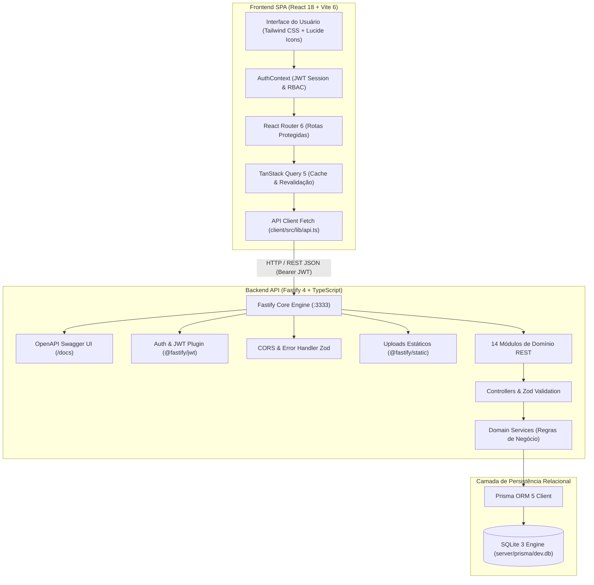
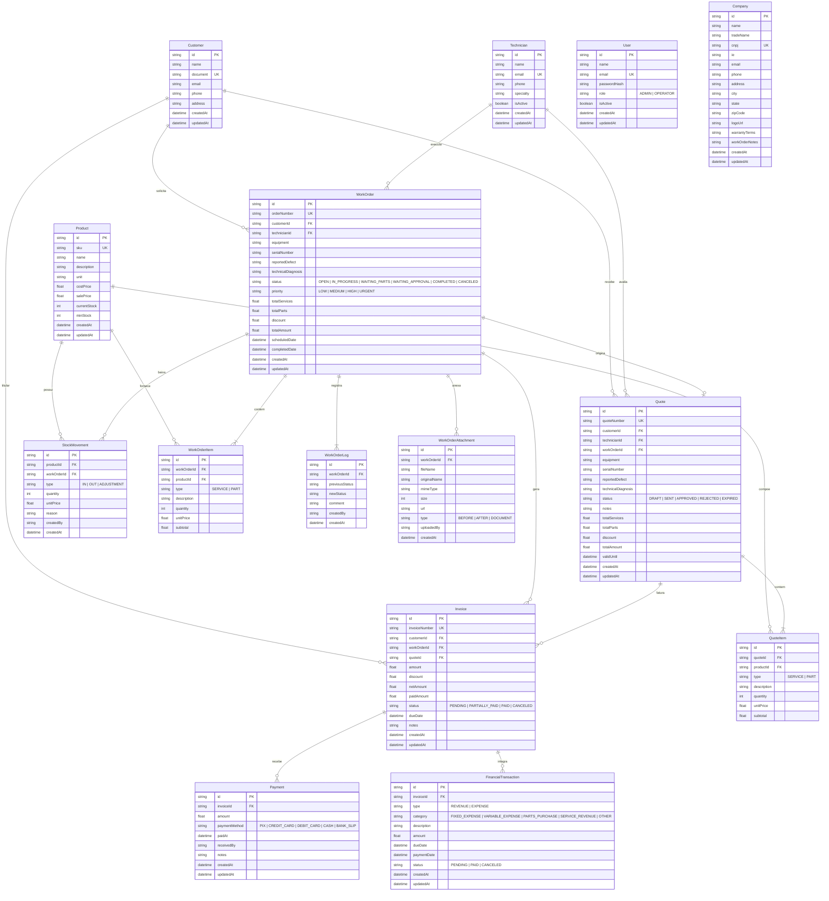
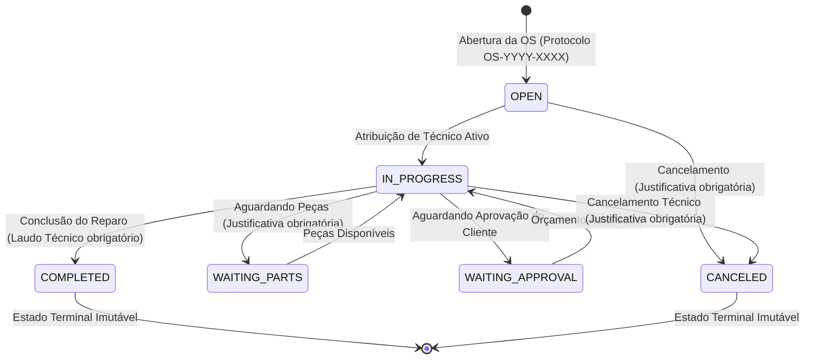
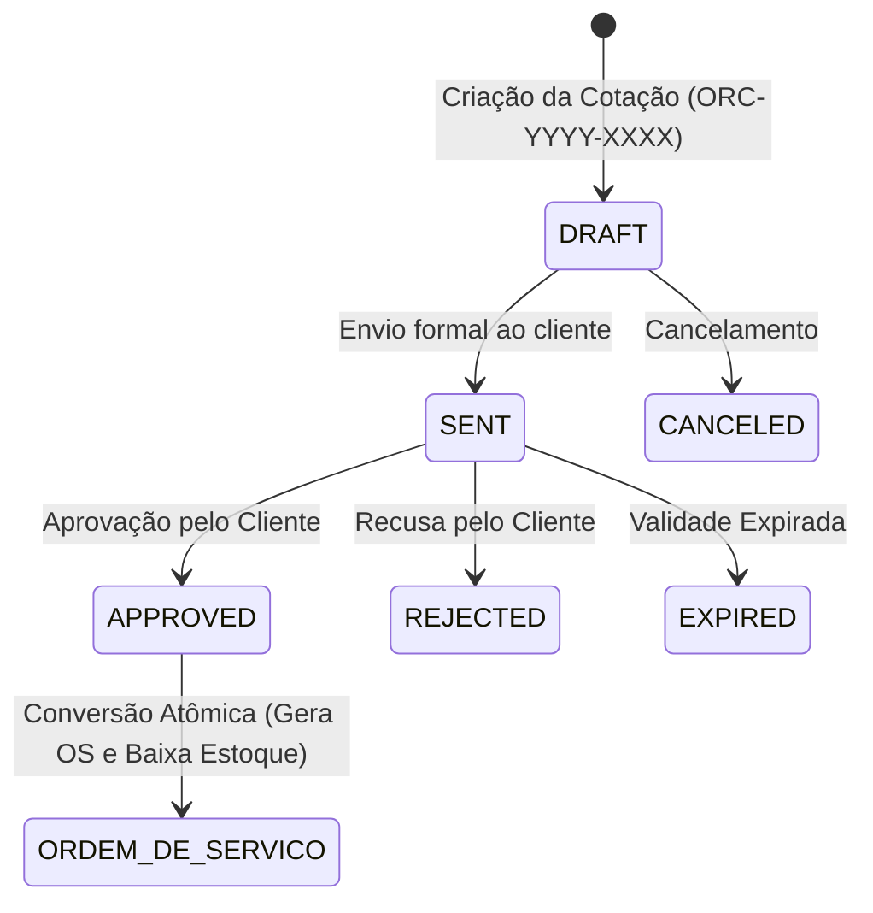

# Sistema de Gestão de Ordens de Serviço (Ordem de Serviço App) — Release v1.1


Plataforma fullstack de padrão industrial para gerenciamento do ciclo de vida operacional, técnico, comercial e financeiro de Ordens de Serviço (OS). Desenvolvida em arquitetura monorepo com alta performance, integridade relacional estrita, controle de acesso baseado em papéis (RBAC), auditoria imutável e interface responsiva.

---

## 📋 Sumário

- [Visão Geral](#-visão-geral)
- [Credenciais de Homologação & RBAC](#-credenciais-de-homologação--rbac)
- [Funcionalidades Principais](#-funcionalidades-principais)
- [Arquitetura do Sistema](#-arquitetura-do-sistema)
- [Stack Tecnológica](#-stack-tecnológica)
- [Estrutura do Monorepo](#-estrutura-do-monorepo)
- [Pré-requisitos](#-pré-requisitos)
- [Guia de Instalação e Execução](#-guia-de-instalação-e-execução)
- [Documentação da API REST & Swagger OpenAPI](#-documentação-da-api-rest--swagger-openapi)
- [Catálogo Completo de Endpoints REST](#-catálogo-completo-de-endpoints-rest)
- [Modelagem de Dados (ERD — 15 Entidades)](#-modelagem-de-dados-erd--15-entidades)
- [Ciclos de Vida & Máquinas de Estados](#-ciclos-de-vida--máquinas-de-estados)
- [Testes Automatizados (260 Testes)](#-testes-automatizados-260-testes)
- [Referência de Scripts](#-referência-de-scripts)
- [Licença](#-licença)

---

## 🎯 Visão Geral

O **Ordem de Serviço App** centraliza toda a cadeia de valor de assistências técnicas especializadas, empresas de engenharia, oficinas e prestadores de serviços. O sistema elimina a dispersão de informações integrando:

1. **Protocolo Sequencial Atômico**: Numeração padronizada e imutável por ano fiscal (`OS-YYYY-XXXX` e `ORC-YYYY-XXXX`).
2. **Máquina de Estados & Trilha de Auditoria**: Controle rigoroso de transições com justificativa obrigatória em pausas/cancelamentos e laudo técnico obrigatório para conclusão.
3. **Catálogo de Peças & Baixa de Estoque**: Controle de produtos com alerta de estoque baixo/crítico e saídas automáticas atreladas às ordens de serviço.
4. **Ciclo Comercial de Orçamentos**: Geração de propostas com conversão transacional direta em Ordens de Serviço (`DRAFT` ➔ `SENT` ➔ `APPROVED`).
5. **Módulo Financeiro & Fluxo de Caixa**: Faturamento de OS, emissão de faturas (`Invoice`), baixa de recebimentos multimeios (`PIX`, `Cartão`, `Boleto`) e conciliação contábil entre receitas e despesas operacionais.
6. **Galeria de Evidências Fotográficas**: Upload multipart (`BEFORE` e `AFTER`) e laudos periciais (`DOCUMENT`) associados às ordens.
7. **Visão Dupla de Produtividade**: Alternância ágil entre Tabela com filtros combinados e Quadro Kanban interativo com drag & drop.
8. **Dashboard Analítico Operacional**: KPIs em tempo real (faturamento realizado, a receber, ticket médio, ordens ativas) e gráficos de produtividade por técnico.
9. **Exportação & Comprovante PDF**: Layout formal e responsivo para impressão térmica e exportação em PDF.

---

## 🔐 Credenciais de Homologação & RBAC

O script de carga inicial (`bun run prisma:seed`) configura automaticamente os seguintes usuários padrão:

| Perfil | E-mail | Senha | Nível de Acesso / Permissões |
| :--- | :--- | :--- | :--- |
| **Administrador (`ADMIN`)** | `admin@empresa.com` | `admin123` | **Acesso Irrestrito**: Gestão de colaboradores, configurações institucionais da empresa, fluxo de caixa gerencial, relatórios e exclusão de registros. |
| **Operador (`OPERATOR`)** | `operador@empresa.com` | `operador123` | **Operação de Balcão**: Atendimento a clientes, gestão de técnicos, abertura/edição de orçamentos e OS, upload de anexos, movimentação de estoque e baixa de faturas. |

---

## 🚀 Funcionalidades Principais

- **Segurança & Autenticação JWT**: Sessões assinadas via `@fastify/jwt` com suporte a Bearer token e interceptores automáticos no cliente web.
- **Gestão Cadastral**:
  - Clientes (PF e PJ com validação matemática de CPF e CNPJ);
  - Técnicos com especialidades e controle de status de atividade;
  - Perfil institucional da empresa com termos legais de garantia (CDC).
- **Gestão Comercial & Orçamentos**:
  - Elaboração de orçamentos com validade temporal e descontos;
  - Conversão de orçamento aprovado em Ordem de Serviço com reserva de estoque atômica.
- **Operação de Ordens de Serviço**:
  - Composição mista de serviços e peças sobressalentes com recálculo dinâmico;
  - Transições formais: `OPEN` ➔ `IN_PROGRESS` ➔ `WAITING_PARTS` / `WAITING_APPROVAL` ➔ `COMPLETED` ou `CANCELED`.
- **Controle de Estoque & Peças**:
  - Catálogo de produtos com SKU único, custos, preços de venda e margens;
  - Histórico auditável de movimentações (`IN`, `OUT`, `ADJUSTMENT`);
  - Listagem imediata de itens com estoque baixo (`currentStock <= minStock`).
- **Faturamento & Financeiro**:
  - Emissão de faturas vinculadas à OS ou avulsas;
  - Registro de pagamentos parciais ou integrais com método (`PIX`, `Cartão`, `Dinheiro`);
  - Extrato do Fluxo de Caixa consolidando receitas realizadas, receitas previstas e despesas operacionais.
- **Anexos e Fotos**:
  - Upload de imagens e PDFs de até 10MB para registro de vistorias "Antes e Depois".

---

## 🏗 Arquitetura do Sistema



---

## 🛠 Stack Tecnológica

### Backend (`server/`)
- **Runtime**: [Bun](https://bun.sh/) / [Node.js](https://nodejs.org/) v20+
- **Framework Web**: [Fastify 4](https://fastify.dev/)
- **Linguagem**: [TypeScript 5.5](https://www.typescriptlang.org/) (`strict: true`)
- **ORM & Banco de Dados**: [Prisma ORM 5](https://www.prisma.io/) com motor SQLite 3
- **Validação & Contratos**: [Zod 3](https://zod.dev/)
- **Autenticação & Criptografia**: `@fastify/jwt` e `bcryptjs`
- **Documentação de API**: `@fastify/swagger` e `@fastify/swagger-ui` (OpenAPI 3.0)
- **Upload & Arquivos**: `@fastify/multipart` e `@fastify/static`
- **Logging**: [Pino](https://getpino.io/) e `pino-pretty`
- **Testes**: [Vitest 5](https://vitest.dev/)

### Frontend (`client/`)
- **Framework SPA**: [React 18](https://react.dev/)
- **Build Tool**: [Vite 6](https://vitejs.dev/)
- **Estilização**: [Tailwind CSS 3.4](https://tailwindcss.com/) com `@tailwindcss/forms`
- **Gerenciamento de Estado de Servidor**: [TanStack Query 5](https://tanstack.com/query/latest)
- **Roteamento**: [React Router 6](https://reactrouter.com/)
- **Iconografia**: [Lucide React](https://lucide.dev/)

---

## 📁 Estrutura do Monorepo

```
ordem-servico-app/
├── package.json               # Configuração e scripts unificados do Monorepo
├── README.md                  # Manual oficial de operação e arquitetura
├── AGENTS.md                  # Regras de ambiente e boas práticas do workspace
├── client/                    # Frontend SPA (React + Vite + Tailwind)
│   ├── src/
│   │   ├── components/        # Componentes compartilhados (Layout, Modal, Badge, etc.)
│   │   ├── contexts/          # Contexto global de autenticação (AuthContext.tsx)
│   │   ├── hooks/             # Custom hooks para consumo de dados via TanStack Query
│   │   ├── lib/               # Cliente HTTP (api.ts) e formatadores de moeda e data
│   │   ├── pages/             # Telas da aplicação (Dashboard, OS, Clientes, Estoque, etc.)
│   │   └── types/             # Definições de tipos e interfaces TypeScript
├── server/                    # Backend API REST (Fastify + Prisma + SQLite)
│   ├── prisma/
│   │   ├── schema.prisma      # Modelagem relacional do banco (15 entidades)
│   │   ├── seed.ts            # Script de carga relacional de demonstração
│   │   └── migrations/        # Histórico de migrações SQL versionadas
│   └── src/
│       ├── app.ts             # Factory buildApp() com plugins e rotas registradas
│       ├── server.ts          # Inicializador HTTP e bind de porta
│       ├── config/            # Variáveis de ambiente tipadas com Zod (env.ts)
│       ├── plugins/           # Plugins Fastify (prisma, swagger, auth, cors, multipart)
│       └── modules/           # 14 Módulos de domínio da aplicação
│           ├── auth/          # Login, renovação e registro
│           ├── users/         # Gestão de usuários e permissões RBAC
│           ├── company/       # Configurações institucionais da empresa
│           ├── customers/     # Cadastro e busca de clientes
│           ├── technicians/   # Gestão de técnicos e especialidades
│           ├── products/      # Catálogo de peças e estoque
│           ├── stock/         # Movimentações e histórico auditável
│           ├── quotes/        # Orçamentos comerciais e conversão em OS
│           ├── work-orders/   # Core de OS, status, itens e timeline
│           ├── attachments/   # Fotos de vistorias e laudos periciais
│           ├── invoices/      # Faturamento e pagamentos
│           ├── financial/     # Gestão financeira e fluxo de caixa
│           ├── metrics/       # Indicadores e consolidações de dashboard
│           └── health/        # Monitoramento e integridade do banco SQLite
```

---

## ⚙️ Pré-requisitos

- **[Bun](https://bun.sh/)** v1.1 ou superior (*recomendado*) OU **[Node.js](https://nodejs.org/)** v20 LTS / v24+
- **Git**

---

## 🚀 Guia de Instalação e Execução

### 1. Clonar o Repositório
```bash
git clone https://github.com/schwenck-e/ordem-servico-app.git
cd ordem-servico-app
```

### 2. Configurar Variáveis de Ambiente
Copie o arquivo de exemplo de ambiente do servidor:
```bash
cp server/.env.example server/.env
```

> As variáveis padrão configuram o servidor na porta `3333`, CORS para `http://localhost:5173`, banco SQLite em `file:./dev.db` e chave JWT de desenvolvimento.

### 3. Instalar Dependências
Execute na raiz do monorepo:
```bash
bun install
```

### 4. Executar Migrações do Banco de Dados
Crie as 15 tabelas relacionais no SQLite executando as migrações:
```bash
bun run prisma:migrate
```

### 5. Popular o Banco com Dados Iniciais (Seed)
Carregue todo o ecossistema de dados de homologação (Usuários, Empresa, Clientes, Técnicos, Produtos, Movimentações, Orçamentos, OSs, Anexos, Faturas, Pagamentos e Transações Financeiras):
```bash
bun run prisma:seed
```

### 6. Iniciar a Aplicação Fullstack
Inicie simultaneamente o Backend Fastify e o Frontend Vite com um único comando:
```bash
bun run dev
```

A aplicação estará disponível nos seguintes endereços:
- 🌐 **Frontend (Web App)**: [http://localhost:5173](http://localhost:5173)
- 🔌 **Backend (API REST)**: [http://localhost:3333](http://localhost:3333)
- 📖 **Documentação Swagger UI**: [http://localhost:3333/docs](http://localhost:3333/docs)

---

## 📡 Documentação da API REST & Swagger OpenAPI

A API REST disponibiliza documentação interativa OpenAPI 3.0 via Swagger UI em **`http://localhost:3333/docs`** (com redirecionamento automático a partir de `/documentation`).

### Autenticação no Swagger UI:
1. Acesse `http://localhost:3333/docs`;
2. Execute o endpoint `POST /auth/login` com as credenciais `admin@empresa.com` / `admin123`;
3. Copie o `token` retornado;
4. Clique no botão verde **Authorize** no topo da página;
5. Cole o token no campo de valor e clique em **Authorize**;
6. Todos os endpoints protegidos utilizarão automaticamente o cabeçalho `Authorization: Bearer <token>`.

---

## 📑 Catálogo Completo de Endpoints REST

| Módulo / Tag | Método | Endpoint | Perfil | Descrição |
| :--- | :--- | :--- | :--- | :--- |
| **Health** | `GET` | `/health` | Público | Verificação de integridade da API e conectividade SQLite |
| **Auth** | `POST` | `/auth/login` | Público | Autenticação de usuário e obtenção do token JWT |
| | `GET` | `/auth/me` | Autenticado | Retorna os dados do usuário conectado na sessão |
| | `POST` | `/auth/register` | ADMIN | Cadastro de novos colaboradores |
| **Users** | `GET` | `/users` | ADMIN | Listagem paginada de usuários do sistema |
| | `POST` | `/users` | ADMIN | Cadastro de usuário com definição de perfil (`ADMIN`/`OPERATOR`) |
| | `GET` | `/users/:id` | ADMIN | Detalhes de um usuário específico por UUID |
| | `PUT` | `/users/:id` | ADMIN | Atualização cadastral de dados, senha ou perfil |
| | `DELETE` | `/users/:id` | ADMIN | Remoção de usuário do sistema |
| **Company** | `GET` | `/company` | Autenticado | Consulta dos dados cadastrais e fiscais da empresa |
| | `PUT` | `/company` | ADMIN | Atualização dos dados institucionais e termos de garantia |
| **Customers** | `GET` | `/customers` | Autenticado | Listagem paginada de clientes com busca textual |
| | `POST` | `/customers` | Autenticado | Cadastro de cliente com validação de CPF/CNPJ |
| | `GET` | `/customers/:id` | Autenticado | Detalhes do cliente com histórico de ordens |
| | `PUT` | `/customers/:id` | Autenticado | Atualização de dados cadastrais |
| | `DELETE` | `/customers/:id` | Autenticado | Exclusão de cliente (bloqueado se possuir OS) |
| **Technicians** | `GET` | `/technicians` | Autenticado | Listagem de técnicos com filtro de especialidade e atividade |
| | `POST` | `/technicians` | Autenticado | Cadastro de técnico com validação de e-mail |
| | `GET` | `/technicians/:id` | Autenticado | Detalhes do técnico e ordens atribuídas |
| | `PUT` | `/technicians/:id` | Autenticado | Atualização cadastral ou ativação/desativação |
| | `DELETE` | `/technicians/:id` | Autenticado | Exclusão de técnico (bloqueado se possuir OS ativa) |
| **Products** | `GET` | `/products` | Autenticado | Listagem paginada de produtos e peças com busca por SKU |
| | `POST` | `/products` | Autenticado | Cadastro de produto com saldo inicial de estoque |
| | `GET` | `/products/low-stock`| Autenticado | Produtos com estoque crítico (`currentStock <= minStock`) |
| | `GET` | `/products/:id` | Autenticado | Detalhes do produto com histórico de movimentações |
| | `PUT` | `/products/:id` | Autenticado | Atualização de preços de custo/venda e estoque mínimo |
| | `DELETE` | `/products/:id` | ADMIN | Exclusão de produto (bloqueado se possuir movimentações) |
| **Stock** | `POST` | `/stock/movements`| Autenticado | Registro de movimentação de estoque (`IN`/`OUT`/`ADJUSTMENT`)|
| | `GET` | `/stock/movements`| Autenticado | Histórico auditável de movimentações de estoque |
| **Quotes** | `GET` | `/quotes` | Autenticado | Listagem de orçamentos com filtros de status e período |
| | `POST` | `/quotes` | Autenticado | Criação de orçamento comercial em status `DRAFT` |
| | `GET` | `/quotes/:id` | Autenticado | Detalhes completos do orçamento com itens e valores |
| | `PUT` | `/quotes/:id` | Autenticado | Edição de orçamento (permitido apenas em `DRAFT`) |
| | `PATCH` | `/quotes/:id/status`| Autenticado | Atualização de status (`DRAFT` ➔ `SENT` ➔ `APPROVED`/`REJECTED`)|
| | `POST` | `/quotes/:id/convert`| Autenticado| Conversão transacional de orçamento em Ordem de Serviço |
| **WorkOrders** | `GET` | `/work-orders` | Autenticado | Listagem paginada de OS com filtros de status e prioridade |
| | `POST` | `/work-orders` | Autenticado | Abertura de OS com itens (serviços e peças) e protocolo |
| | `GET` | `/work-orders/:id` | Autenticado | Detalhes completos da OS (cliente, técnico, itens e logs) |
| | `PUT` | `/work-orders/:id` | Autenticado | Atualização de dados cadastrais, itens e descontos |
| | `PATCH` | `/work-orders/:id/status`| Autenticado| Transição de status da OS (regras da máquina de estados) |
| | `GET` | `/work-orders/:id/timeline`| Autenticado| Linha do tempo de auditoria de eventos e mudanças |
| **Attachments**| `POST` | `/work-orders/:id/attachments`| Autenticado| Upload de foto ou laudo PDF (multipart/form-data) |
| | `GET` | `/work-orders/:id/attachments`| Autenticado| Listagem de anexos da OS com filtro por categoria |
| | `DELETE` | `/work-orders/:id/attachments/:attachmentId`| Autenticado| Exclusão de anexo e arquivo físico |
| **Invoices** | `GET` | `/invoices` | Autenticado | Listagem paginada de faturas emitidas |
| | `POST` | `/invoices` | Autenticado | Emissão de fatura vinculada à OS |
| | `GET` | `/invoices/:id` | Autenticado | Detalhes da fatura com histórico de pagamentos |
| | `PATCH` | `/invoices/:id/cancel`| ADMIN | Cancelamento formal de fatura pendente |
| | `POST` | `/invoices/:id/payments`| Autenticado| Registro de liquidação de pagamento (`PIX`, `Cartão`, etc.) |
| **Financial** | `GET` | `/financial/cashflow`| Autenticado | Resumo consolidado do Fluxo de Caixa (receitas e despesas) |
| | `GET` | `/financial/transactions`| Autenticado| Listagem paginada de lançamentos financeiros |
| | `POST` | `/financial/transactions`| Autenticado| Lançamento avulso de receita ou despesa operacional |
| | `PATCH` | `/financial/transactions/:id/status`| Autenticado| Atualização de status de transação (`PAID`/`CANCELED`) |
| **Metrics** | `GET` | `/metrics/summary` | Autenticado | Indicadores de gestão (total de OS, faturamento, ticket médio) |
| | `GET` | `/metrics/by-status`| Autenticado | Distribuição de ordens de serviço por status operacional |
| | `GET` | `/metrics/by-technician`| Autenticado| Produtividade e receita gerada por cada técnico |

---

## 🗄 Modelagem de Dados (ERD — 15 Entidades)



---

## 🔄 Ciclos de Vida & Máquinas de Estados

### 1. Máquina de Estados da Ordem de Serviço


### 2. Ciclo de Aprovação e Conversão de Orçamentos


---

## 🧪 Testes Automatizados (260 Testes)

A integridade do sistema é garantida por uma bateria de **260 testes automatizados** via [Vitest](https://vitest.dev/), executados sequencialmente sem mock de banco de dados para aferição real de transações e chaves estrangeiras:

### Execução dos Testes:
```bash
bun run test
```

### Detalhamento da Cobertura:
- **`auth.test.ts`** (21 testes): Login JWT, validação de hash bcrypt, rotas protegidas `/auth/me` e criação de colaboradores.
- **`users.test.ts`** (24 testes): CRUD de usuários, proteção contra duplicação de e-mail e regras de permissão RBAC.
- **`company.test.ts`** (11 testes): Consulta cadastral pública e atualização exclusiva por `ADMIN`.
- **`customers.test.ts`** (22 testes): Validação de CPF e CNPJ, unicidade, listagem paginada e bloqueio de exclusão com OS vinculada.
- **`technicians.test.ts`** (29 testes): Gestão de equipe, especialidades, alternância de atividade e integridade referencial.
- **`products.test.ts`** (17 testes): Cadastro de peças, SKU único, controle de margens e cálculo de estoque crítico (`low-stock`).
- **`stock.test.ts`** (9 testes): Movimentações de entrada (`IN`), saída (`OUT`) e auditoria de saldos.
- **`quotes.test.ts`** (22 testes): Ciclo de propostas comerciais, edição restrita a rascunhos e conversão transacional para OS.
- **`work-order.test.ts`** (44 testes): Abertura com protocolo, substituição de itens, recálculo financeiro, máquina de estados e auditoria de timeline.
- **`work-order-stock.test.ts`** (4 testes): Dedução de saldo de peças e integração operacional com o estoque.
- **`attachments.test.ts`** (13 testes): Upload de arquivos multipart, restrições de formato MIME, isolamento e exclusão em disco.
- **`invoices.test.ts`** (26 testes): Emissão de faturas, cálculo de saldo líquido e quitação integral/parcial via pagamentos.
- **`financial.test.ts`** (17 testes): Lançamentos de receitas e despesas, fluxo de caixa gerencial e sincronização contábil.
- **`work-order-lifecycle.e2e.test.ts`** (1 teste integrado): Fluxo de ciclo de vida completo de ponta a ponta (abertura, transições, laudo e encerramento).

---

## 📜 Referência de Scripts

| Comando | Descrição |
| :--- | :--- |
| `bun run dev` *(ou `dev:all`)* | Inicia Backend Fastify e Frontend Vite simultaneamente com logs coloridos |
| `bun run dev:server` | Inicia somente o Backend com hot-reload (`tsx watch`) |
| `bun run dev:client` | Inicia somente o Frontend com Vite dev server |
| `bun run build` | Compila o Backend (`tsc`) e gera o bundle de produção do Frontend (`vite build`) |
| `bun run typecheck` | Executa verificação de tipos TypeScript em todo o monorepo (0 erros) |
| `bun run test` | Executa todos os 260 testes automatizados via Vitest |
| `bun run prisma:migrate` | Aplica as migrações relacionais no banco SQLite local |
| `bun run prisma:generate` | Regenera o cliente Prisma Client |
| `bun run prisma:seed` | Popula o banco com o conjunto completo de dados de homologação |
| `bun run prisma:studio` | Abre a interface gráfica Prisma Studio para inspeção dos dados |

---

## 📄 Licença

Este projeto está sob a licença [MIT](LICENSE).
