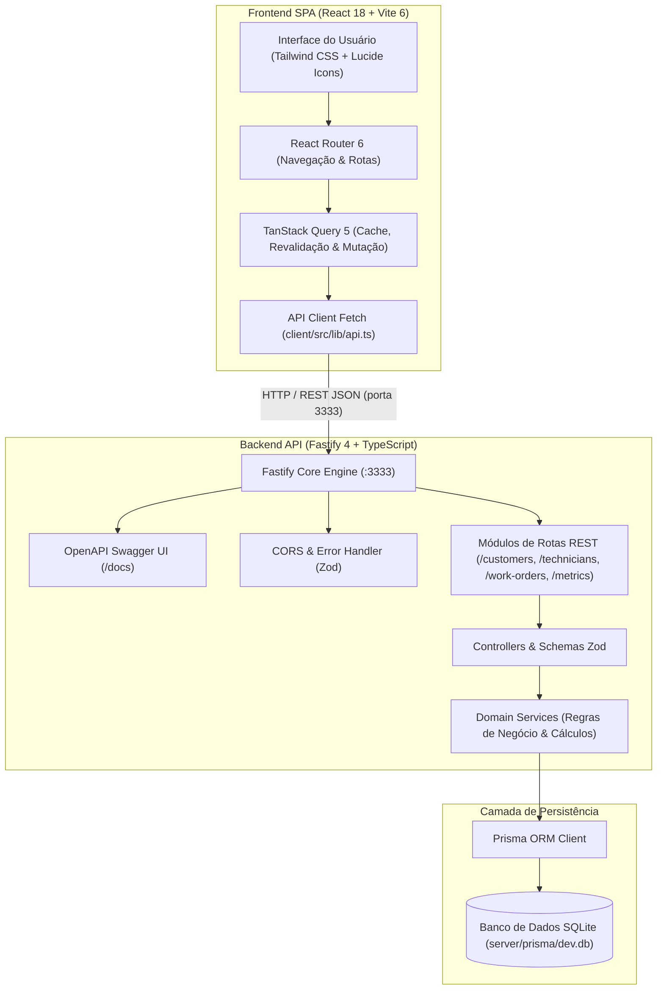
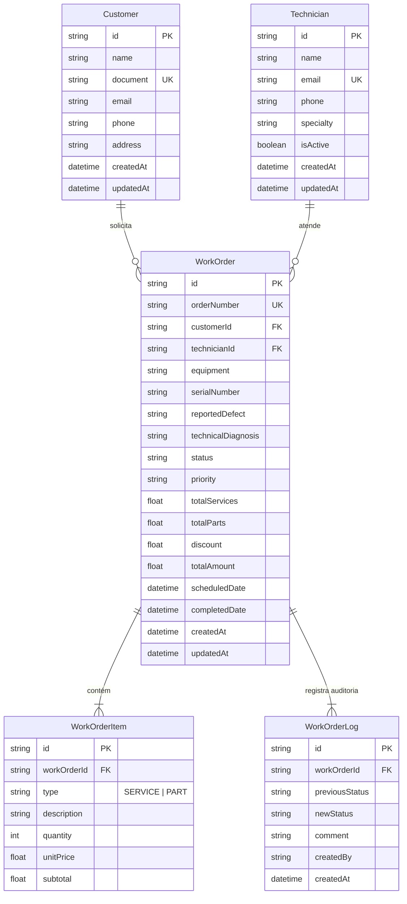
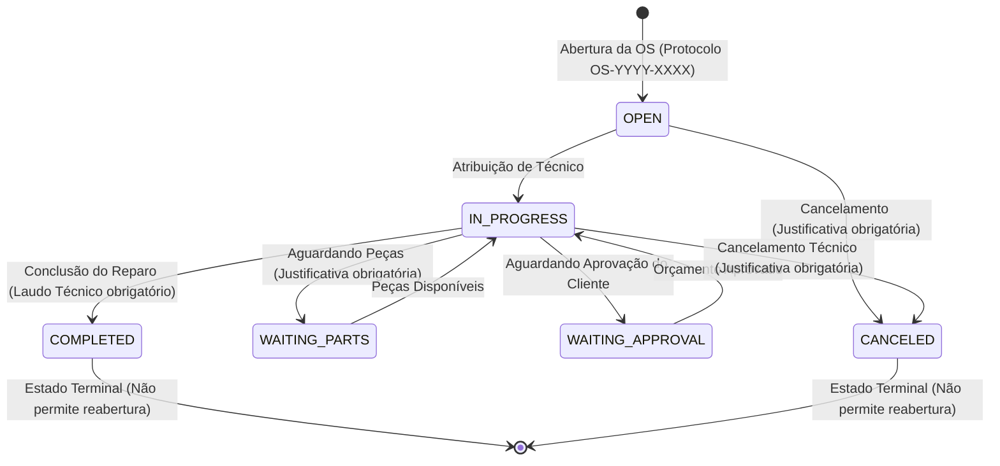

# Sistema de Gestão de Ordens de Serviço (Ordem de Serviço App)


Plataforma fullstack moderna para gerenciamento do ciclo de vida operacional, técnico e financeiro de Ordens de Serviço (OS). Desenvolvida em arquitetura monorepo com foco em alta performance, integridade de dados e experiência do usuário ágil e responsiva.

---

## 📋 Sumário

- [Visão Geral](#-visão-geral)
- [Funcionalidades Principais](#-funcionalidades-principais)
- [Arquitetura do Sistema](#-arquitetura-do-sistema)
- [Stack Tecnológica](#-stack-tecnológica)
- [Estrutura do Monorepo](#-estrutura-do-monorepo)
- [Pré-requisitos](#-pré-requisitos)
- [Guia de Instalação e Execução](#-guia-de-instalação-e-execução)
- [Documentação da API REST & Swagger](#-documentação-da-api-rest--swagger)
- [Modelagem de Dados (ERD)](#-modelagem-de-dados-erd)
- [Máquina de Estados da OS](#-máquina-de-estados-da-os)
- [Testes Automatizados](#-testes-automatizados)
- [Referência de Scripts](#-referência-de-scripts)

---

## 🎯 Visão Geral

O **Ordem de Serviço App** centraliza a operação técnica de assistências especializadas, oficinas e provedores de serviços. A solução resolve a perda de histórico e atritos operacionais ao oferecer:

1. **Protocolo Único Sequencial**: Geração padronizada de protocolo por ano (`OS-YYYY-XXXX`).
2. **Máquina de Estados Rigorosa**: Controle estrito de transições de status com auditoria imutável (timeline de eventos) e laudo técnico obrigatório para encerramento.
3. **Composição Financeira Dinâmica**: Itens de serviço (`SERVICE`) e peças (`PART`) com cálculo automático de subtotais, descontos e totalização à prova de falhas.
4. **Visão Dupla de Produtividade**: Alternância fluida entre visualização em Tabela paginada/filtrável e Quadro Kanban interativo com drag & drop.
5. **Dashboard Analítico Operacional**: KPIs em tempo real (total de ordens, receita realizada, faturamento pendente, ticket médio) e gráficos de distribuição por status e técnico.
6. **Comprovante Otimizado para Impressão**: Layout pronto para impressão e exportação em PDF da Ordem de Serviço com dados cadastrais, itens e laudo para o cliente.

---

## 🚀 Funcionalidades Principais

- **Gestão de Clientes**: Cadastro completo com validação de unicidade de documento (CPF/CNPJ) e e-mail, telefones e endereços.
- **Gestão de Técnicos**: Cadastro de equipe técnica com especialidade e controle de status operacional (`isActive`).
- **Abertura e Edição de OS**:
  - Seleção de cliente e atribuição facultativa de técnico responsável.
  - Classificação por prioridade (`LOW`, `MEDIUM`, `HIGH`, `URGENT`).
  - Tabela dinâmica de serviços e peças com cálculos reativos de totais.
- **Ciclo de Vida e Auditoria**:
  - Transições formais: `Aberta` -> `Em Andamento` -> `Aguardando Peças` / `Aguardando Aprovação` -> `Concluída` ou `Cancelada`.
  - Histórico cronológico completo de mudanças com justificativa obrigatória em pausas e cancelamentos.
- **Relatórios & Métricas**:
  - Agrupamentos analíticos por status e desempenho por técnico.
  - Filtro por intervalo de datas (`startDate` / `endDate`).

---

## 🏗 Arquitetura do Sistema



---

## 🛠 Stack Tecnológica

### Backend (`server/`)
- **Runtime & Gerenciador**: [Bun](https://bun.sh/) / [Node.js](https://nodejs.org/)
- **Framework Web**: [Fastify 4](https://fastify.dev/) com arquitetura baseada em plugins
- **Linguagem**: [TypeScript 5.5](https://www.typescriptlang.org/) em modo estrito (`strict: true`)
- **ORM & Banco de Dados**: [Prisma ORM 5](https://www.prisma.io/) com driver SQLite 3
- **Validação de Schemas**: [Zod 3](https://zod.dev/)
- **Documentação de API**: `@fastify/swagger` e `@fastify/swagger-ui` (OpenAPI 3.0)
- **Logging**: [Pino](https://getpino.io/) com `pino-pretty` para desenvolvimento
- **Testes Automatizados**: [Vitest 5](https://vitest.dev/)

### Frontend (`client/`)
- **Framework SPA**: [React 18](https://react.dev/)
- **Build Tool**: [Vite 6](https://vitejs.dev/)
- **Estilização**: [Tailwind CSS 3.4](https://tailwindcss.com/) com `@tailwindcss/forms`
- **Gerenciamento de Estado de Servidor**: [TanStack Query 5](https://tanstack.com/query/latest)
- **Roteamento**: [React Router 6](https://reactrouter.com/)
- **Iconografia**: [Lucide React](https://lucide.dev/)

### Monorepo & Ferramental
- **Orquestração Concorrente**: [Concurrently](https://github.com/open-cli-tools/concurrently)
- **Tipagem Unificada**: TypeScript compartilhado em workspaces Bun/NPM

---

## 📁 Estrutura do Monorepo

```
ordem-servico-app/
├── package.json               # Configuração e scripts unificados do Monorepo
├── README.md                  # Documentação técnica central do projeto
├── AGENTS.md                  # Diretrizes e regras de ambiente para agentes e automação
├── client/                    # Frontend SPA (React + Vite + Tailwind)
│   ├── index.html
│   ├── package.json
│   ├── tailwind.config.js
│   ├── tsconfig.json
│   ├── vite.config.ts
│   └── src/
│       ├── App.tsx            # Árvore de rotas e layout raiz
│       ├── main.tsx           # Ponto de entrada React com QueryClientProvider
│       ├── components/        # Componentes compartilhados (Layout, Modal, Badge, etc.)
│       ├── hooks/             # Custom hooks para consumo da API via TanStack Query
│       ├── lib/               # Cliente HTTP (api.ts) e utilitários de formatação (utils.ts)
│       ├── pages/             # Telas da aplicação (Dashboard, WorkOrders, Form, Details, etc.)
│       └── types/             # Definições de tipos e interfaces TypeScript
└── server/                    # Backend API REST (Fastify + Prisma + SQLite)
    ├── package.json
    ├── tsconfig.json
    ├── vitest.config.ts       # Configuração do Vitest com execução sequencial
    ├── .env.example           # Variáveis de ambiente padrão
    ├── prisma/
    │   ├── schema.prisma      # Schema de modelagem de dados do banco
    │   ├── seed.ts            # Script de carga inicial de demonstração
    │   └── migrations/        # Histórico de migrações relacionais SQL
    └── src/
        ├── app.ts             # Factory buildApp() com plugins e rotas registradas
        ├── server.ts          # Inicializador HTTP e bind de porta
        ├── config/            # Variáveis de ambiente tipadas com Zod (env.ts)
        ├── plugins/           # Plugins Fastify (prisma.ts, swagger.ts, cors.ts)
        └── modules/           # Módulos de domínio da aplicação
            ├── customers/     # Rotas, controllers, services e testes de clientes
            ├── technicians/   # Rotas, controllers, services e testes de técnicos
            ├── work-orders/   # Core de OS, máquina de estados, timeline e testes E2E
            └── metrics/       # Agrupamentos analíticos e indicadores de dashboard
```

---

## ⚙️ Pré-requisitos

Antes de iniciar, certifique-se de possuir instalado em sua máquina:
- **[Bun](https://bun.sh/)** v1.1 ou superior (*recomendado*) OU **[Node.js](https://nodejs.org/)** v20 LTS / v24+
- **Git**

---

## 🚀 Guia de Instalação e Execução

### 1. Clonar o Repositório
```bash
git clone https://github.com/schwenck-e/ordem-servico-app.git
cd ordem-servico-app
```

### 2. Configurar Variáveis de Ambiente
Copie o arquivo de exemplo de ambiente do servidor:
```bash
cp server/.env.example server/.env
```
> O arquivo `.env` pré-configura a porta `3333`, CORS para `http://localhost:5173` e SQLite em `file:./dev.db`.

### 3. Instalar Dependências
Execute na raiz do monorepo:
```bash
bun install
```

### 4. Executar Migrações do Banco de Dados
Crie as tabelas SQLite aplicando as migrações existentes:
```bash
bun run prisma:migrate
```

### 5. Popular o Banco com Dados Iniciais (Seed)
Carregue clientes, técnicos e ordens de serviço de demonstração:
```bash
bun run prisma:seed
```

### 6. Iniciar a Aplicação Fullstack
Inicie simultaneamente o Backend Fastify e o Frontend Vite com um único comando:
```bash
bun run dev
```

A aplicação estará disponível nos seguintes endereços:
- 🌐 **Frontend (Web App)**: [http://localhost:5173](http://localhost:5173)
- 🔌 **Backend (API REST)**: [http://localhost:3333](http://localhost:3333)
- 📖 **Documentação Interativa Swagger**: [http://localhost:3333/docs](http://localhost:3333/docs)

---

## 📡 Documentação da API REST & Swagger

A API REST disponibiliza documentação interativa OpenAPI / Swagger acessível em **`http://localhost:3333/docs`**.

### Catálogo de Endpoints

| Método | Endpoint | Descrição |
| :--- | :--- | :--- |
| **GET** | `/health` | Verificação de integridade da API e conectividade com SQLite |
| **GET** | `/customers` | Listagem paginada de clientes com filtros de busca |
| **POST** | `/customers` | Cadastro de novo cliente (validação de documento e e-mail único) |
| **GET** | `/customers/:id` | Obter detalhes de um cliente específico |
| **PUT** | `/customers/:id` | Atualizar dados cadastrais de um cliente |
| **DELETE** | `/customers/:id` | Exclusão de cliente (bloqueado se possuir OS vinculada) |
| **GET** | `/technicians` | Listagem de técnicos (filtro por status ativo/inativo) |
| **POST** | `/technicians` | Cadastro de novo técnico com especialidade |
| **GET** | `/technicians/:id` | Obter dados de um técnico específico |
| **PUT** | `/technicians/:id` | Atualizar dados ou ativar/desativar técnico |
| **DELETE** | `/technicians/:id` | Exclusão de técnico (bloqueado se possuir OS ativa) |
| **GET** | `/work-orders` | Listagem de OS com paginação, filtros de status, técnico e busca |
| **POST** | `/work-orders` | Abertura de OS com geração de protocolo e itens de serviço/peça |
| **GET** | `/work-orders/:id` | Detalhes completos da OS (inclui cliente, técnico, itens e logs) |
| **PUT** | `/work-orders/:id` | Edição de dados, diagnóstico e recálculo de itens/desconto |
| **PATCH** | `/work-orders/:id/status` | Transição de status da OS (regras da máquina de estados) |
| **GET** | `/work-orders/:id/timeline` | Histórico cronológico de auditoria e transições de status da OS |
| **GET** | `/metrics/summary` | Indicadores consolidados de gestão (total de OS, faturamento, tickets) |
| **GET** | `/metrics/by-status` | Distribuição percentual e financeira das OS agrupadas por status |
| **GET** | `/metrics/by-technician` | Indicadores de produtividade e faturamento por técnico responsável |

---

## 🗄 Modelagem de Dados (ERD)



---

## 🔄 Máquina de Estados da OS

O ciclo de vida da Ordem de Serviço obedece a regras de negócio estritas que impedem saltos inválidos e garantem a auditoria em cada etapa:



### Regras de Negócio e Validações
1. **Transição para `IN_PROGRESS`**: Requer que um técnico ativo esteja atribuído à OS ou seja fornecido no payload da transição.
2. **Transição para `WAITING_PARTS` ou `WAITING_APPROVAL`**: Exige comentário/justificativa para rastreabilidade de pausas na operação.
3. **Transição para `COMPLETED`**:
   - É obrigatório que o laudo técnico (`technicalDiagnosis`) esteja preenchido previamente ou seja informado no corpo da requisição.
   - Preenche automaticamente a data de encerramento (`completedDate`).
4. **Transição para `CANCELED`**: Exige justificativa formal no comentário do log.
5. **Estados Terminais**: Ordens em status `COMPLETED` ou `CANCELED` são imutáveis contra novas mudanças de status.

---

## 🧪 Testes Automatizados

A suíte de testes automatizados é executada com [Vitest](https://vitest.dev/), cobrindo testes unitários, testes de integração de contratos REST e a suíte completa de testes End-to-End (E2E).

### Executar Toda a Bateria de Testes
```bash
bun run test
```

### Executar Testes com Interface Visual ou Cobertura
```bash
# Executar apenas a suíte E2E de ciclo de vida completo
bun run --cwd server test src/modules/work-orders/work-order-lifecycle.e2e.test.ts

# Executar testes em modo watch (desenvolvimento contínuo)
bun run --cwd server test --watch
```

### Cobertura da Suíte de Testes
- **Customers**: 22 testes (criação com CPF/CNPJ, e-mail único, listagem paginada, busca, remoção com bloqueio relacional).
- **Technicians**: 27 testes (validações cadastrais, alternância de atividade, proteção contra exclusão de técnico com OS ativa).
- **Work Orders**: 44 testes (cálculo de itens, subtotais e descontos, validações Zod, máquina de estados, timeline de auditoria).
- **Metrics**: 15 testes (consolidação de receita, ticket médio, agrupamento por status e distribuição por técnico).
- **E2E Lifecycle**: 3 testes integrados de ponta a ponta (abertura, transições, laudo, conclusão, timeline e impacto analítico).
- **Total**: **111 testes automatizados** com 100% de aprovação.

---

## 📜 Referência de Scripts

Todos os comandos essenciais estão disponíveis na raiz do monorepo:

| Comando | Descrição |
| :--- | :--- |
| `bun run dev` *(ou `dev:all`)* | Inicia Backend Fastify e Frontend Vite concorrentemente com logs coloridos |
| `bun run dev:server` | Inicia somente o Backend com hot-reload (`tsx watch`) |
| `bun run dev:client` | Inicia somente o Frontend com Vite dev server |
| `bun run build` | Compila o Backend (`tsc`) e gera bundle de produção do Frontend (`vite build`) |
| `bun run typecheck` | Executa verificação estrita de tipos TypeScript em todo o monorepo |
| `bun run test` | Executa todos os testes automatizados do backend via Vitest |
| `bun run prisma:migrate` | Aplica as migrações relacionais no banco de dados SQLite local |
| `bun run prisma:generate` | Gera o cliente tipado do Prisma Client |
| `bun run prisma:seed` | Popula o banco com dados de teste e demonstração |
| `bun run prisma:studio` | Abre o painel visual Prisma Studio para inspeção dos dados |

---

## 📄 Licença

Este projeto está sob a licença [MIT](LICENSE).
