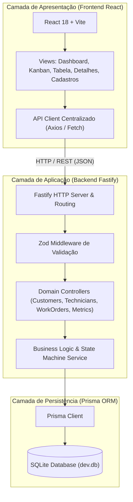
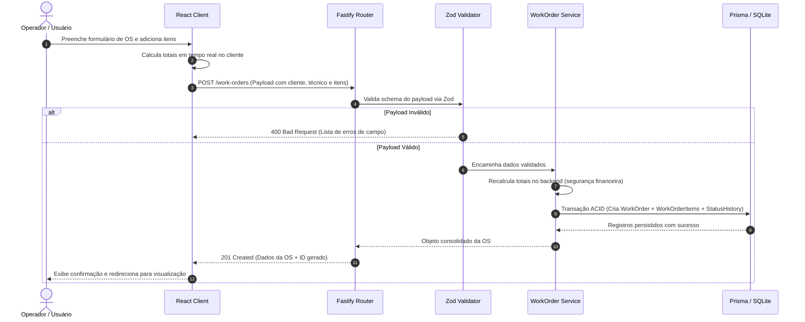

# Arquitetura do Sistema e Topologia de Componentes

O `ordem-servico-app` adota uma arquitetura em camadas orientada a serviços e desacoplada, separando claramente o cliente (SPA) do servidor REST.

---

## 🏛️ Visão em Camadas

---

## 🔄 Fluxo de Processamento de uma Ordem de Serviço

O diagrama abaixo ilustra a criação de uma Ordem de Serviço completa com cálculo dinâmico de totais e gravação do primeiro evento na trilha de auditoria:

