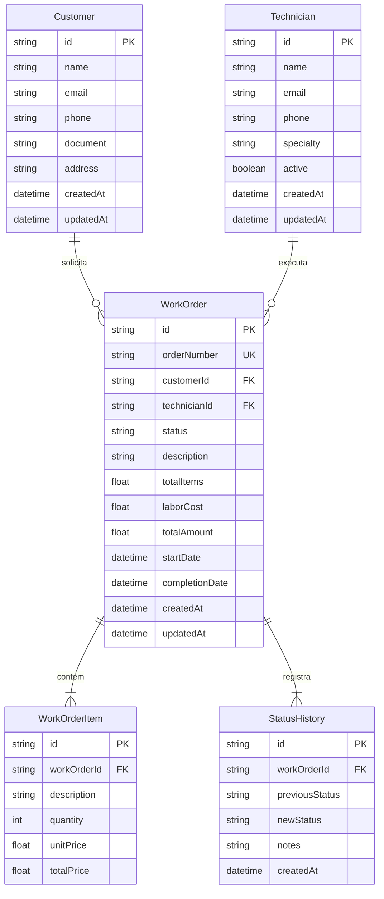

# Modelagem de Dados & Schema Relacional

A persistência do sistema é gerenciada pelo **Prisma ORM** sobre **SQLite**, garantindo integridade relacional e facilidade de execução local.

---

## 📊 Diagrama Entidade-Relacionamento (ERD)

---

## 🔍 Regras de Integridade Relacional

1. **Delete Cascading:**
   - A exclusão de uma `WorkOrder` remove em cascata todos os seus `WorkOrderItem` e `StatusHistory` correspondentes.
   - Não é permitido deletar um `Customer` ou `Technician` que possua Ordens de Serviço associadas (proteção contra perda de dados fiscais/operacionais).
2. **Cálculo de Totais:**
   - `totalItems = SUM(WorkOrderItem.totalPrice)`
   - `totalAmount = totalItems + laborCost`
   - O cálculo é validado no backend antes de qualquer persistência.
