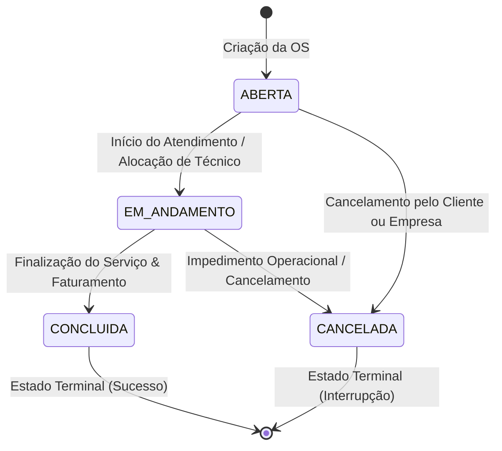

# Workflow & Máquina de Estados (State Machine)

O ciclo de vida de uma Ordem de Serviço é regido por uma **Máquina de Estados Finita (FSM)** determinística. Nenhuma transição de status ocorre sem validação prévia de integridade e registro compulsório no histórico de auditoria.

---

## 🧭 Diagrama de Estados do Ciclo de Vida

---

## 📋 Tabela de Regras e Transições Permitidas

| Status Atual | Próximo Status Permitido | Regras de Negócio Obrigatórias |
| :--- | :--- | :--- |
| **`ABERTA`** | `EM_ANDAMENTO` | Requer que ao menos um técnico esteja atribuído à OS. |
| **`ABERTA`** | `CANCELADA` | Requer justificativa de cancelamento no registro de histórico. |
| **`EM_ANDAMENTO`** | `CONCLUIDA` | Todos os itens/serviços devem ter valores válidos e data de conclusão preenchida. |
| **`EM_ANDAMENTO`** | `CANCELADA` | Permite interrupção com motivo registrado na auditoria. |
| **`CONCLUIDA`** | *(Nenhum)* | **Estado Terminal:** Uma OS concluída não pode ser reaberta sem novo processo de auditoria. |
| **`CANCELADA`** | *(Nenhum)* | **Estado Terminal:** Uma OS cancelada permanece arquivada para integridade histórica. |

---

## 📜 Mecanismo de Trilha de Auditoria (`StatusHistory`)

Toda transição bem-sucedida gera atomicamente um registro imutável na tabela `StatusHistory`:
- `previousStatus`: Status de origem.
- `newStatus`: Status de destino validado.
- `notes`: Observações adicionadas pelo operador.
- `createdAt`: Timestamp preciso em formato ISO 8601 UTC.

Esses registros alimentam a **Timeline de Auditoria** na tela de detalhes da OS e o layout de impressão em PDF.
