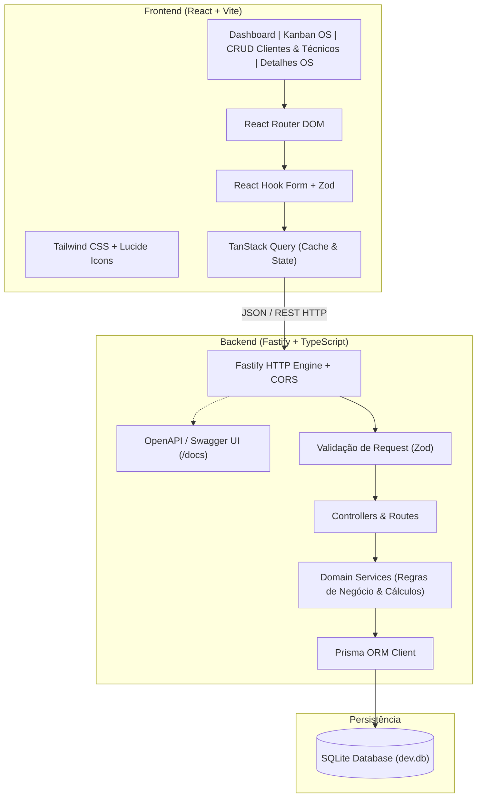
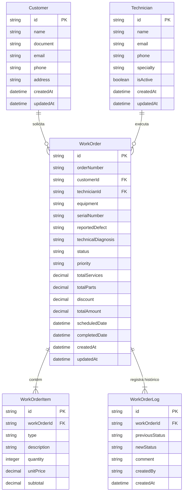
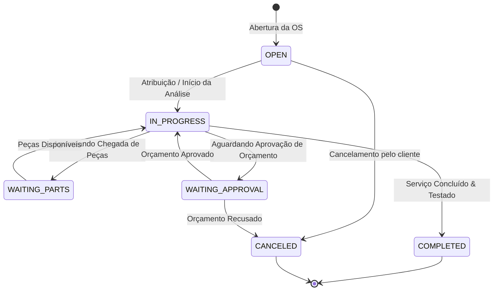

# Especificação Técnica & Backlog do Produto: Gestão de Ordens de Serviço (ordem-servico-app)

- **Documento:** `thoughts/shared/research/2026-09-15-ordem-servico-backlog.md`
- **Autor:** Technical Product Manager (PM)
- **Data:** 2026-09-15 (Atualizado em 2026-09-19)
- **Status:** Aprovado para Desenvolvimento
- **Épico Linear:** `[ÉPICO] Sistema de Gestão de Ordens de Serviço (ordem-servico-app)` ([ELI-7](https://linear.app/elima/issue/ELI-7/epico-sistema-de-gestao-de-ordens-de-servico-ordem-servico-app))
- **Projeto Linear:** [Sistema de Gestão de Ordens de Serviço (ordem-servico-app)](https://linear.app/elima/project/sistema-de-gestao-de-ordens-de-servico-ordem-servico-app-87eccf4d-eaf0)

---

## 1. Visão Geral do Produto

O **ordem-servico-app** é uma solução completa para gerenciamento do ciclo de vida de Ordens de Serviço (OS), desenhada para prestadores de serviços, assistências técnicas e equipes de manutenção.

### 1.1 Objetivos de Negócio
- **Agilidade no atendimento:** Reduzir o tempo de abertura de chamados e diagnóstico de equipamentos.
- **Rastreabilidade total:** Registrar todas as transições de status, apontamentos técnicos, peças utilizadas e mão de obra em uma linha do tempo auditável.
- **Transparência e Controle Financeiro:** Cálculo automatizado de peças, serviços, descontos e valor total faturado.
- **Visibilidade Operacional:** Dashboard em tempo real com indicadores-chave (OS abertas, em andamento, tempo médio e faturamento).

---

## 2. Arquitetura Técnica Proposta



### 2.1 Stack Tecnológica

#### Backend
- **Runtime & Linguagem:** Node.js (LTS v20+) com TypeScript estrito.
- **Web Framework:** Fastify v4/v5 (alta performance, baixo overhead de I/O, arquitetura de plugins).
- **ORM & Banco de Dados:** Prisma ORM com SQLite (zero dependência externa de infraestrutura para dev local, migrações declarativas e tipagem ponta a ponta).
- **Validação de Dados:** Zod (validação de schemas de entrada, parâmetros de rota e tipagem inferida).
- **Documentação de API:** `@fastify/swagger` e `@fastify/swagger-ui` expondo `/docs`.
- **Utilitários:** `cors`, `pino` (logs estruturados), `date-fns` (cálculos de datas).

#### Frontend
- **Framework & Bundler:** React 18/19 com Vite e TypeScript.
- **Estilização:** Tailwind CSS (utility-first, design tokens coesos e alta responsividade).
- **Ícones:** `lucide-react` (ícones vetoriais modernos e leves).
- **Gerenciamento de Estado de Servidor:** TanStack Query v5 (React Query) para caching automático, revalidação e mutações otimistas.
- **Roteamento:** React Router DOM v6.
- **Formulários:** React Hook Form + `@hookform/resolvers/zod` para validações client-side dinâmicas.
- **Componentes de Feedback:** Toasts de notificação (`sonner` ou similar) e modais acessíveis.

### 2.2 Estrutura do Repositório (Monorepo)
```text
ordem-servico-app/
├── package.json              # Scripts globais (dev, build, lint, test)
├── .env.example              # Exemplo de variáveis de ambiente
├── server/                   # Backend Fastify + Prisma
│   ├── prisma/
│   │   ├── schema.prisma     # Definição do banco e modelos
│   │   ├── migrations/       # Histórico de migrações
│   │   └── seed.ts           # Dados de teste para desenvolvimento
│   ├── src/
│   │   ├── config/           # Configurações de ambiente
│   │   ├── plugins/          # Plugins Fastify (prisma, swagger, cors)
│   │   ├── modules/          # Módulos por domínio (customers, technicians, work-orders, metrics)
│   │   │   ├── [module].routes.ts
│   │   │   ├── [module].schemas.ts
│   │   │   └── [module].service.ts
│   │   ├── app.ts            # Configuração do Fastify
│   │   └── server.ts         # Ponto de entrada (listen)
│   ├── tsconfig.json
│   └── package.json
└── client/                   # Frontend React + Vite + Tailwind
    ├── src/
    │   ├── components/       # Componentes compartilhados (Layout, Button, Modal, Table)
    │   ├── hooks/            # Custom hooks e queries
    │   ├── lib/              # Instância da API (fetch/axios) e helpers
    │   ├── pages/            # Telas (Dashboard, WorkOrders, Customers, Technicians, WorkOrderDetail)
    │   ├── types/            # Tipagens globais do frontend
    │   ├── App.tsx           # Configuração de rotas e providers
    │   └── main.tsx          # Ponto de entrada React
    ├── tailwind.config.js
    ├── vite.config.ts
    └── package.json
```

---

## 3. Modelo de Dados e Domínio

### 3.1 Diagrama Entidade-Relacionamento (ERD)



### 3.2 Máquina de Estados da Ordem de Serviço



---

## 4. Épico e Backlog no Linear

O projeto e o épico foram criados no Linear com 14 tarefas atômicas e sequenciais.

- **Épico:** `[ÉPICO] Sistema de Gestão de Ordens de Serviço (ordem-servico-app)` ([ELI-7](https://linear.app/elima/issue/ELI-7/epico-sistema-de-gestao-de-ordens-de-servico-ordem-servico-app))
- **Time Linear:** Elima (`ELI`)
- **Projeto:** `Sistema de Gestão de Ordens de Serviço (ordem-servico-app)`

### 4.1 Tabela Consolidada de Tarefas

| ID Linear | Tarefa | Camada | Prioridade | Status |
| :--- | :--- | :---: | :---: | :---: |
| **[ELI-8](https://linear.app/elima/issue/ELI-8)** | [Backend] Setup da Arquitetura Fastify, TypeScript, Prisma SQLite e Swagger | `backend` | Urgente (P1) | Todo |
| **[ELI-9](https://linear.app/elima/issue/ELI-9)** | [Backend] Modelagem do Banco de Dados Prisma (Schema, Migrations e Seeds) | `backend` | Urgente (P1) | Todo |
| **[ELI-10](https://linear.app/elima/issue/ELI-10)** | [Frontend] Setup do React Vite + Tailwind CSS + Roteamento e API Client | `frontend` | Urgente (P1) | Todo |
| **[ELI-11](https://linear.app/elima/issue/ELI-11)** | [Backend] API CRUD de Clientes com Validação Zod | `backend` | Alta (P2) | Todo |
| **[ELI-12](https://linear.app/elima/issue/ELI-12)** | [Backend] API CRUD de Técnicos com Validação Zod | `backend` | Alta (P2) | Todo |
| **[ELI-13](https://linear.app/elima/issue/ELI-13)** | [Frontend] Módulo e Telas de Gestão de Clientes e Técnicos | `frontend` | Alta (P2) | Todo |
| **[ELI-14](https://linear.app/elima/issue/ELI-14)** | [Backend] API Core de Ordens de Serviço (Criação, Itens e Cálculo de Totais) | `backend` | Urgente (P1) | Todo |
| **[ELI-15](https://linear.app/elima/issue/ELI-15)** | [Backend] Workflow de Status, Validação de Transições e Histórico de Auditoria | `backend` | Alta (P2) | Todo |
| **[ELI-16](https://linear.app/elima/issue/ELI-16)** | [Frontend] Painel de Ordens de Serviço (Visualização em Tabela e Kanban) | `frontend` | Urgente (P1) | Todo |
| **[ELI-17](https://linear.app/elima/issue/ELI-17)** | [Frontend] Formulário Completo de Abertura e Edição de OS | `frontend` | Urgente (P1) | Todo |
| **[ELI-18](https://linear.app/elima/issue/ELI-18)** | [Frontend] Tela de Detalhes da OS, Timeline e Layout de Impressão/PDF | `frontend` | Alta (P2) | Todo |
| **[ELI-19](https://linear.app/elima/issue/ELI-19)** | [Backend] API de Métricas e Indicadores Operacionais | `backend` | Média (P3) | Todo |
| **[ELI-20](https://linear.app/elima/issue/ELI-20)** | [Frontend] Dashboard Operacional com KPIs e Gráficos | `frontend` | Média (P3) | Todo |
| **[ELI-21](https://linear.app/elima/issue/ELI-21)** | [Fullstack] Integração End-to-End, Scripts de Execução e Documentação | `backend` / `frontend` | Alta (P2) | Todo |

---

## 5. Detalhamento das Tarefas & Critérios de Aceitação (DoD)

### Fase 1: Fundação & Setup da Infraestrutura

#### [ELI-8] Setup da Arquitetura Fastify, TypeScript, Prisma SQLite e Swagger
- **Descrição:** Configuração base do backend com Fastify, TypeScript, Prisma ORM com SQLite, variáveis de ambiente (.env), script de dev com hot-reload (tsx) e documentação Swagger interativa.
- **Definition of Done (DoD):**
  - [ ] Projeto backend configurado com `package.json`, `tsconfig.json` e scripts (`dev`, `build`, `start`).
  - [ ] Fastify configurado com CORS, plugin de log (`pino`) e tratamento global de erros.
  - [ ] Prisma ORM configurado com provider SQLite e conexão validada.
  - [ ] Swagger / OpenAPI documentado e acessível na rota `/docs`.
  - [ ] Endpoint de healthcheck `GET /health` respondendo 200 OK com timestamp.

#### [ELI-9] Modelagem do Banco de Dados Prisma (Schema, Migrations e Seeds)
- **Descrição:** Criação do schema Prisma para as entidades do sistema (`Customer`, `Technician`, `WorkOrder`, `WorkOrderItem`, `WorkOrderLog`), aplicação da primeira migration e seed de dados.
- **Definition of Done (DoD):**
  - [ ] `prisma/schema.prisma` contendo enums/strings para status (`OPEN`, `IN_PROGRESS`, `WAITING_PARTS`, `WAITING_APPROVAL`, `COMPLETED`, `CANCELED`) e prioridades (`LOW`, `MEDIUM`, `HIGH`, `URGENT`).
  - [ ] Relacionamentos 1:N configurados com chaves estrangeiras e integridade referencial.
  - [ ] Migração aplicada com sucesso no SQLite local (`prisma migrate dev`).
  - [ ] Script de seed populando ao menos 3 clientes, 2 técnicos e 3 ordens de serviço realistas.
  - [ ] Prisma Client gerado e instanciado como singleton tipado.

#### [ELI-10] Setup do React Vite + Tailwind CSS + Roteamento e API Client
- **Descrição:** Setup da aplicação frontend utilizando React com Vite, TypeScript, Tailwind CSS, ícones Lucide React, layout responsivo com Sidebar/Navbar, React Router DOM e TanStack Query.
- **Definition of Done (DoD):**
  - [ ] Aplicação React Vite criada e configurada com TypeScript sem avisos de compilação.
  - [ ] Tailwind CSS configurado com paleta de cores moderna, tipografia e responsividade.
  - [ ] Layout base com Sidebar de navegação rápida, Header superior e área de conteúdo.
  - [ ] React Router configurado com rotas para Dashboard, Ordens de Serviço, Clientes e Técnicos.
  - [ ] TanStack Query (React Query) configurado globalmente no topo da árvore React.
  - [ ] Cliente HTTP configurado com base URL apontando para a porta do backend.

---

### Fase 2: Cadastros Base (Clientes e Técnicos)

#### [ELI-11] API CRUD de Clientes com Validação Zod
- **Descrição:** Implementação dos endpoints REST para gerenciamento de Clientes com validação estrita via schemas Zod: criação, listagem com paginação e busca, consulta por ID, atualização e deleção.
- **Definition of Done (DoD):**
  - [ ] Rotas REST implementadas: `POST /customers`, `GET /customers`, `GET /customers/:id`, `PUT /customers/:id`, `DELETE /customers/:id`.
  - [ ] Validação Zod para CPF/CNPJ, e-mail, telefone e endereço.
  - [ ] Suporte a busca por termo (query param `search`) e paginação (`page`, `limit`).
  - [ ] Tratamento de erros de duplicidade (HTTP 409) e recurso não encontrado (HTTP 404).
  - [ ] Rotas devidamente documentadas no Swagger.

#### [ELI-12] API CRUD de Técnicos com Validação Zod
- **Descrição:** Implementação dos endpoints REST para gerenciamento de Técnicos com suporte a especialidades, status de atividade (ativo/inativo), telefone e e-mail.
- **Definition of Done (DoD):**
  - [ ] Rotas REST implementadas: `POST /technicians`, `GET /technicians`, `GET /technicians/:id`, `PUT /technicians/:id`, `DELETE /technicians/:id`.
  - [ ] Filtro por status de atividade (ex: listar apenas técnicos ativos para vincular à OS).
  - [ ] Validações Zod aplicadas no body e nos parâmetros.
  - [ ] Swagger atualizado com schemas e respostas das rotas de técnicos.

#### [ELI-13] Módulo e Telas de Gestão de Clientes e Técnicos
- **Descrição:** Desenvolvimento das interfaces visuais para listagem, busca, cadastro e edição de Clientes e Técnicos, incluindo modais/formulários, máscaras de inputs e toasts de feedback.
- **Definition of Done (DoD):**
  - [ ] Tabela de Clientes com busca em tempo real (debounced) e paginação.
  - [ ] Modal/Formulário de criação e edição com React Hook Form e validação Zod.
  - [ ] Máscaras para CPF/CNPJ, Telefone e CEP.
  - [ ] Gestão de Técnicos com indicador visual de status (Ativo/Inativo) e especialidade.
  - [ ] Toasts de feedback para operações de sucesso e erro.
  - [ ] Estados de carregamento (skeletons) e empty states amigáveis.

---

### Fase 3: Core de Ordens de Serviço

#### [ELI-14] API Core de Ordens de Serviço (Criação, Itens e Cálculo de Totais)
- **Descrição:** Implementação da API principal de Ordens de Serviço com geração automática de protocolo sequencial (ex: OS-0001), vinculação de cliente e técnico, itens dinâmicos (serviços e peças) e cálculo automático de totais.
- **Definition of Done (DoD):**
  - [ ] Rotas implementadas: `POST /work-orders`, `GET /work-orders`, `GET /work-orders/:id`, `PUT /work-orders/:id`.
  - [ ] Geração de protocolo único sequencial legível.
  - [ ] Criação transacional atômica no Prisma (`WorkOrder` + `WorkOrderItem` + log inicial).
  - [ ] Cálculo automático e garantido no backend dos totais (`totalServices` + `totalParts` - `discount` = `totalAmount`).
  - [ ] Filtros por status, prioridade, técnico, cliente e data na listagem.

#### [ELI-15] Workflow de Status, Validação de Transições e Histórico de Auditoria
- **Descrição:** Gerenciamento de transições de status da Ordem de Serviço com validação de regras de negócio e inserção automática de eventos na linha do tempo de auditoria (`WorkOrderLog`).
- **Definition of Done (DoD):**
  - [ ] Rota `PATCH /work-orders/:id/status` para alteração de status com justificativa.
  - [ ] Máquina de estados validando transições válidas (ex: não concluir OS sem diagnóstico preenchido).
  - [ ] Inserção automática de logs com timestamp, status anterior, novo status e comentário.
  - [ ] Rota para consultar histórico/timeline de uma OS (`GET /work-orders/:id/timeline`).

#### [ELI-16] Painel de Ordens de Serviço (Visualização em Tabela e Kanban)
- **Descrição:** Criação da tela principal de Ordens de Serviço com alternância entre visualização em Tabela e Quadro Kanban (agrupado por status), com filtros avançados.
- **Definition of Done (DoD):**
  - [ ] Visualização em Tabela com badges coloridos de status e prioridade.
  - [ ] Visualização em Kanban com colunas por status e cards informativos.
  - [ ] Barra de filtros persistente (status, prioridade, técnico, data).
  - [ ] Ações rápidas no card (abrir detalhes, alterar status rápido).

#### [ELI-17] Formulário Completo de Abertura e Edição de OS
- **Descrição:** Construção da interface para abertura e edição de OS, permitindo seleção de cliente, técnico, dados do equipamento, e inclusão dinâmica de serviços e peças com cálculo de totais em tempo real.
- **Definition of Done (DoD):**
  - [ ] Autocomplete/seletor de Clientes e Técnicos.
  - [ ] Seção para equipamento/dispositivo (marca, modelo, serial, defeito relatado).
  - [ ] Tabela dinâmica para adicionar e remover itens/serviços com cálculo de subtotal e total em tempo real.
  - [ ] Validações de campos obrigatórios e prazos.
  - [ ] Salvamento com feedback e redirecionamento para os detalhes da OS criada.

#### [ELI-18] Tela de Detalhes da OS, Timeline e Layout de Impressão/PDF
- **Descrição:** Página de detalhes da Ordem de Serviço com visão 360°, laudo técnico, lista discriminada de serviços e peças, linha do tempo interativa e layout de impressão para comprovante.
- **Definition of Done (DoD):**
  - [ ] Visualização completa com dados da OS, cliente, equipamento e técnico.
  - [ ] Linha do tempo (timeline vertical) mostrando histórico cronológico de mudanças e notas.
  - [ ] Modal para atualização rápida de status e inserção de laudo técnico.
  - [ ] Layout estilizado para impressão (`@media print`) limpo para comprovante do cliente.

---

### Fase 4: Métricas, Dashboard e Homologação Final

#### [ELI-19] API de Métricas e Indicadores Operacionais
- **Descrição:** Implementação de endpoints analíticos para fornecer métricas consolidadas: total de OS por status, faturamento do mês, ticket médio e distribuição por técnicos.
- **Definition of Done (DoD):**
  - [ ] Rota `GET /metrics/summary` retornando contadores de status e faturamento total.
  - [ ] Rota `GET /metrics/by-status` e `GET /metrics/by-technician`.
  - [ ] Filtros por período (data inicial e data final).
  - [ ] Consultas otimizadas com agregações Prisma (`groupBy`, `_count`, `_sum`).

#### [ELI-20] Dashboard Operacional com KPIs e Gráficos
- **Descrição:** Criação da tela inicial (Dashboard) com cartões de KPIs (Total de OS abertas, em andamento, concluídas, faturamento), gráficos de distribuição e lista de OS recentes.
- **Definition of Done (DoD):**
  - [ ] Cards de KPIs no topo com contadores e valores monetários em destaque.
  - [ ] Gráficos interativos (distribuição de status e volume de atendimentos).
  - [ ] Tabela de Ordens de Serviço recentes com acesso direto.
  - [ ] Seletor de período para atualização dinâmica dos dados.

#### [ELI-21] Integração End-to-End, Scripts de Execução e Documentação
- **Descrição:** Testes de integração cobrindo o fluxo completo da OS, script unificado de inicialização e documentação técnica completa no README.
- **Definition of Done (DoD):**
  - [ ] Script para executar backend e frontend simultaneamente (`npm run dev:all` ou similar).
  - [ ] Teste de integração automatizado cobrindo criação, atualização de status e fechamento de OS.
  - [ ] Documentação completa no `README.md` com guia de instalação, schema, rotas e arquitetura.
  - [ ] Validação de build estático e linting sem erros em ambos os pacotes.

---

## 6. Próximos Passos de Execução

1. **Sprint 1 (Fundações):** Executar [ELI-8], [ELI-9] e [ELI-10] para ter o esqueleto fullstack rodando localmente com banco populado.
2. **Sprint 2 (Cadastros & Core API):** Executar [ELI-11], [ELI-12], [ELI-13] e [ELI-14].
3. **Sprint 3 (Workflow, UI de OS & Detalhes):** Executar [ELI-15], [ELI-16], [ELI-17] e [ELI-18].
4. **Sprint 4 (Dashboard & Go-Live):** Executar [ELI-19], [ELI-20] e [ELI-21].
