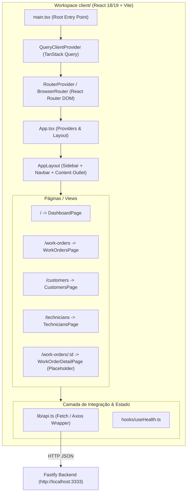

# Research: ELI-10 — Setup do React Vite + Tailwind CSS + Roteamento e API Client

**Date**: 2026-09-20T21:28:00-03:00  
**Researcher**: schwenck-e  
**Git Commit**: [5d8d5c768ce70539b51256c76c45b141aa6d4e6d](https://github.com/schwenck-e/ordem-servico-app/commit/5d8d5c768ce70539b51256c76c45b141aa6d4e6d)  
**Branch**: `eli-9-database-model`  
**Repository**: [schwenck-e/ordem-servico-app](https://github.com/schwenck-e/ordem-servico-app)  

## Research Question

Documentar e analisar o estado atual do repositório, a especificação técnica e os requisitos de integração para o ticket **ELI-10** (`[Frontend] Setup do React Vite + Tailwind CSS + Roteamento e API Client`), mapeando a arquitetura necessária para a camada de frontend (`client/`), a integração com o monorepo existente e a comunicação HTTP com a API Fastify já construída.

---

## Summary

O ticket **[ELI-10](https://linear.app/elima/issue/ELI-10)** é a terceira tarefa da **Fase 1 (Fundação & Setup da Infraestrutura)** do épico **[ELI-7](https://linear.app/elima/issue/ELI-7)** (`[ÉPICO] Sistema de Gestão de Ordens de Serviço (ordem-servico-app)`), com prioridade **Urgente (P1)**. Ele representa a criação e estruturação inicial do frontend web da aplicação dentro da arquitetura monorepo.

No estado atual do repositório (commit [5d8d5c7](https://github.com/schwenck-e/ordem-servico-app/commit/5d8d5c768ce70539b51256c76c45b141aa6d4e6d)):
1. **Backend funcional**: A API Fastify está implementada em [`server/`](https://github.com/schwenck-e/ordem-servico-app/blob/5d8d5c768ce70539b51256c76c45b141aa6d4e6d/server/) (ticket **ELI-8**), e o modelo de banco de dados Prisma SQLite com migrações e seed está concluído (ticket **ELI-9**).
2. **Camada Frontend inexistente**: O diretório `client/` ainda não existe fisicamente na árvore de diretórios. O arquivo raiz [`package.json`](https://github.com/schwenck-e/ordem-servico-app/blob/5d8d5c768ce70539b51256c76c45b141aa6d4e6d/package.json#L5-L7) lista unicamente `"server"` no array de `workspaces`.
3. **Configuração CORS já compatível**: O backend Fastify em [`server/src/config/env.ts`](https://github.com/schwenck-e/ordem-servico-app/blob/5d8d5c768ce70539b51256c76c45b141aa6d4e6d/server/src/config/env.ts#L9) e [`server/src/plugins/cors.ts`](https://github.com/schwenck-e/ordem-servico-app/blob/5d8d5c768ce70539b51256c76c45b141aa6d4e6d/server/src/plugins/cors.ts#L6-L10) já define como padrão de CORS a origem `http://localhost:5173` (porta padrão do Vite em modo de desenvolvimento) e habilita origens irrestritas em ambiente `development`.
4. **Dependências subsequentes**: Todos os 5 tickets frontend do roadmap ([ELI-13], [ELI-16], [ELI-17], [ELI-18], [ELI-20]) dependem diretamente da conclusão desta infraestrutura base de UI e client HTTP.

---

## Detailed Findings

### 1. Metadados e Definição da Tarefa no Linear (ELI-10)

- **Identificador:** `ELI-10`
- **Título:** `[Frontend] Setup do React Vite + Tailwind CSS + Roteamento e API Client`
- **Projeto Linear:** `Sistema de Gestão de Ordens de Serviço (ordem-servico-app)`
- **Épico Pai:** `ELI-7` — `[ÉPICO] Sistema de Gestão de Ordens de Serviço (ordem-servico-app)`
- **Camada:** `frontend`
- **Prioridade:** 1 (Urgente)
- **Status:** Todo / Backlog
- **Critérios de Aceitação / Definition of Done (DoD):**
  - [ ] Aplicação React Vite criada e configurada com TypeScript sem avisos de compilação.
  - [ ] Tailwind CSS configurado com paleta de cores moderna, tipografia e responsividade.
  - [ ] Layout base com Sidebar de navegação rápida, Header superior e área de conteúdo.
  - [ ] React Router configurado com rotas para Dashboard, Ordens de Serviço, Clientes e Técnicos.
  - [ ] TanStack Query (React Query) configurado globalmente no topo da árvore React.
  - [ ] Cliente HTTP configurado com base URL apontando para a porta do backend (`http://localhost:3333`).

---

### 2. Estado Atual do Repositório

#### 2.1 Estrutura de Diretórios Existente
```text
ordem-servico-app/
├── package.json              # Monorepo root
├── bun.lock                  # Lockfile unificado Bun
├── AGENTS.md                 # Diretrizes e regras de ambiente
├── thoughts/                 # Memória compartilhada e especificações
│   └── shared/
│       ├── plans/
│       │   ├── 2026-09-19-ELI-8-backend-architecture-setup.md
│       │   └── 2026-09-20-ELI-9-modelagem-banco-dados-prisma.md
│       └── research/
│           ├── 2026-09-15-ordem-servico-backlog.md
│           ├── 2026-09-19-ELI-8-backend-architecture-setup.md
│           └── 2026-09-20-ELI-9-modelagem-banco-dados-prisma.md
└── server/                   # Backend Fastify 4 + TypeScript + Prisma SQLite
    ├── prisma/
    │   ├── schema.prisma     # Entidades: AppHealth, Customer, Technician, WorkOrder, WorkOrderItem, WorkOrderLog
    │   ├── migrations/       # Migrações aplicadas
    │   └── seed.ts           # Seeds de teste
    ├── src/
    │   ├── config/env.ts     # PORT=3333, CORS_ORIGIN=http://localhost:5173
    │   ├── plugins/          # cors, swagger, prisma
    │   ├── modules/health/   # GET /health
    │   ├── app.ts            # Fastify buildApp
    │   └── server.ts         # Fastify listen
    ├── package.json
    └── tsconfig.json
```

#### 2.2 Root `package.json` Atual
Em [`package.json`](https://github.com/schwenck-e/ordem-servico-app/blob/5d8d5c768ce70539b51256c76c45b141aa6d4e6d/package.json#L1-L15):
```json
{
  "name": "ordem-servico-monorepo",
  "version": "1.0.0",
  "private": true,
  "workspaces": [
    "server"
  ],
  "scripts": {
    "dev:server": "npm run dev --workspace=server",
    "build:server": "npm run build --workspace=server",
    "seed:server": "npm run seed --workspace=server"
  },
  "devDependencies": {}
}
```
*Observação*: Para comportar o frontend, o workspace `"client"` precisará ser registrado em `workspaces`, e scripts agregadores (`dev:client`, `build:client`, `typecheck:client`, etc.) devem ser adicionados na raiz conforme orientações do `AGENTS.md`.

#### 2.3 Backend e Pontos de Integração Existentes
- **Porta padrão do servidor HTTP**: `3333` ([`server/src/config/env.ts:5`](https://github.com/schwenck-e/ordem-servico-app/blob/5d8d5c768ce70539b51256c76c45b141aa6d4e6d/server/src/config/env.ts#L5)).
- **CORS**: Configurado com `origin: env.NODE_ENV === 'development' ? true : env.CORS_ORIGIN` e `credentials: true` ([`server/src/plugins/cors.ts:6-10`](https://github.com/schwenck-e/ordem-servico-app/blob/5d8d5c768ce70539b51256c76c45b141aa6d4e6d/server/src/plugins/cors.ts#L6-L10)).
- **Documentação OpenAPI / Swagger**: Disponível em `http://localhost:3333/documentation` ([`server/src/plugins/swagger.ts:24`](https://github.com/schwenck-e/ordem-servico-app/blob/5d8d5c768ce70539b51256c76c45b141aa6d4e6d/server/src/plugins/swagger.ts#L24)).
- **Healthcheck Endpoint**: `GET /health` responde com JSON:
  ```json
  {
    "status": "ok",
    "timestamp": "2026-09-20T...",
    "uptime": 12.34,
    "database": {
      "status": "connected"
    }
  }
  ```
  Este endpoint serve como teste inicial ideal para o cliente HTTP e hook do TanStack Query no frontend.

---

### 3. Especificação da Arquitetura do Frontend (`client/`)

Conforme detalhado na seção 2 do documento de backlog ([`thoughts/shared/research/2026-09-15-ordem-servico-backlog.md:61-113`](https://github.com/schwenck-e/ordem-servico-app/blob/5d8d5c768ce70539b51256c76c45b141aa6d4e6d/thoughts/shared/research/2026-09-15-ordem-servico-backlog.md#L61-L113)):



#### 3.1 Tecnologias e Bibliotecas Exigidas
- **Bundler & Runtime**: Vite 5+ com plugin `@vitejs/plugin-react` e TypeScript estrito.
- **Estilização**: Tailwind CSS v3 com PostCSS e Autoprefixer.
- **Roteamento**: `react-router-dom` v6.
- **Gerenciamento de Estado de Servidor / Cache**: `@tanstack/react-query` v5.
- **Ícones**: `lucide-react`.
- **Notificações / Feedback**: `clsx`, `tailwind-merge` (utilitários para componentes reutilizáveis).

#### 3.2 Estrutura de Arquivos Planejada para `client/`
```text
client/
├── index.html
├── package.json
├── tsconfig.json
├── tsconfig.node.json
├── vite.config.ts
├── tailwind.config.js
├── postcss.config.js
└── src/
    ├── index.css                     # Diretivas @tailwind base, components, utilities
    ├── main.tsx                      # Bootstrap React DOM + TanStack QueryClientProvider
    ├── App.tsx                       # Definição de rotas principais
    ├── components/
    │   ├── layout/
    │   │   ├── AppLayout.tsx         # Estrutura com Sidebar, Header e <Outlet />
    │   │   ├── Sidebar.tsx           # Navegação lateral com links ativos e ícones Lucide
    │   │   └── Header.tsx            # Barra superior com título, status e perfil
    │   └── common/
    │       └── Badge.tsx             # Componentes visuais base
    ├── pages/
    │   ├── DashboardPage.tsx         # Visão geral / boas-vindas / card de status
    │   ├── WorkOrdersPage.tsx        # Placeholder para ELI-16
    │   ├── CustomersPage.tsx         # Placeholder para ELI-13
    │   └── TechniciansPage.tsx       # Placeholder para ELI-13
    ├── lib/
    │   ├── api.ts                    # Cliente HTTP base com baseURL (http://localhost:3333)
    │   └── utils.ts                  # Helper cn() para merge de classes Tailwind
    └── types/
        └── index.ts                  # Tipagens compartilhadas no frontend
```

---

### 4. Relação com as Demais Tarefas do Backlog

| Tarefa | Nome da Tarefa | Relação com ELI-10 |
| :--- | :--- | :--- |
| **ELI-8** | Backend Architecture Setup | **Pré-requisito satisfeito**: Forneceu API Fastify, CORS e endpoint `/health`. |
| **ELI-9** | Modelagem do Banco Prisma | **Pré-requisito satisfeito**: Forneceu entidades de dados e seeds para consumo futuro. |
| **ELI-10** | **Setup Frontend React Vite** | **Esta tarefa**: Estabelece o framework de UI, roteador, client de rede e layout mestre. |
| **ELI-13** | Gestão de Clientes e Técnicos | **Depende de ELI-10**: Renderiza tabelas e formulários dentro das rotas criadas em ELI-10. |
| **ELI-16** | Painel de OS (Tabela e Kanban) | **Depende de ELI-10**: Usa o layout e TanStack Query configurados em ELI-10. |
| **ELI-17** | Formulário de Abertura de OS | **Depende de ELI-10**: Adiciona telas de cadastro e formulários. |
| **ELI-18** | Detalhes da OS e Impressão | **Depende de ELI-10**: Estilização com Tailwind e rota `/work-orders/:id`. |
| **ELI-20** | Dashboard Operacional | **Depende de ELI-10**: Expande a página inicial montada no setup. |
| **ELI-21** | Integração E2E e Scripts | **Depende de ELI-10**: Execução unificada de backend e frontend (`bun dev`). |

---

## Code References

- [`package.json:5-12`](https://github.com/schwenck-e/ordem-servico-app/blob/5d8d5c768ce70539b51256c76c45b141aa6d4e6d/package.json#L5-L12) — Configuração de workspaces e scripts no monorepo.
- [`server/src/config/env.ts:5-10`](https://github.com/schwenck-e/ordem-servico-app/blob/5d8d5c768ce70539b51256c76c45b141aa6d4e6d/server/src/config/env.ts#L5-L10) — Definição das portas (`3333`) e origem de CORS (`http://localhost:5173`).
- [`server/src/plugins/cors.ts:6-10`](https://github.com/schwenck-e/ordem-servico-app/blob/5d8d5c768ce70539b51256c76c45b141aa6d4e6d/server/src/plugins/cors.ts#L6-L10) — Regras de CORS registradas no Fastify.
- [`server/src/modules/health/health.routes.ts:3-54`](https://github.com/schwenck-e/ordem-servico-app/blob/5d8d5c768ce70539b51256c76c45b141aa6d4e6d/server/src/modules/health/health.routes.ts#L3-L54) — Endpoint `GET /health` apto para validação da conectividade do client frontend.
- [`AGENTS.md:12-40`](https://github.com/schwenck-e/ordem-servico-app/blob/5d8d5c768ce70539b51256c76c45b141aa6d4e6d/AGENTS.md#L12-L40) — Diretriz estrita de uso do `bun` como gerenciador de pacotes e executor de scripts.

---

## Architecture Documentation

### 1. Padrões de Frontend Adotados
1. **Utility-First Styling**: Tailwind CSS centralizado em `client/src/index.css` com classes utilitárias para garantir consistência visual sem dependência de frameworks CSS pesados.
2. **Server State vs Client State**: Separação clara utilizando TanStack Query (`@tanstack/react-query`) para requisições assíncronas, cache de requisições HTTP e sincronização com a API Fastify.
3. **Single-Page Application (SPA) Routing**: Utilização de `react-router-dom` com layout padrão baseado em Outlet, garantindo que Sidebar e Header permaneçam fixos durante as transições de rota.
4. **Resiliência e Type Safety**: TypeScript estrito em todo o pacote `client/`, espelhando o padrão já ativo em `server/`.

### 2. Padrões de Monorepo e Scripts
- O monorepo utiliza Bun workspaces (`package.json` raiz):
  - `workspaces: ["server", "client"]`
  - Scripts na raiz como facilitadores: `bun run --cwd client dev`, `bun run --cwd client build`, `bun run --cwd client typecheck`.
- Gerenciamento de dependências pelo lockfile unificado `bun.lock`.

---

## Historical Context (from thoughts/)

- [`thoughts/shared/research/2026-09-15-ordem-servico-backlog.md`](https://github.com/schwenck-e/ordem-servico-app/blob/5d8d5c768ce70539b51256c76c45b141aa6d4e6d/thoughts/shared/research/2026-09-15-ordem-servico-backlog.md): Especificação completa do produto, detalhando o épico ELI-7, a máquina de estados das ordens de serviço e o escopo de cada um dos 14 tickets.
- [`thoughts/shared/research/2026-09-19-ELI-8-backend-architecture-setup.md`](https://github.com/schwenck-e/ordem-servico-app/blob/5d8d5c768ce70539b51256c76c45b141aa6d4e6d/thoughts/shared/research/2026-09-19-ELI-8-backend-architecture-setup.md): Documentação da arquitetura base do backend com Fastify, plugins e endpoint de saúde.
- [`thoughts/shared/research/2026-09-20-ELI-9-modelagem-banco-dados-prisma.md`](https://github.com/schwenck-e/ordem-servico-app/blob/5d8d5c768ce70539b51256c76c45b141aa6d4e6d/thoughts/shared/research/2026-09-20-ELI-9-modelagem-banco-dados-prisma.md): Modelagem relacional do banco de dados SQLite com Prisma e script de seed.

---

## Related Research

- [`thoughts/shared/plans/2026-09-19-ELI-8-backend-architecture-setup.md`](https://github.com/schwenck-e/ordem-servico-app/blob/5d8d5c768ce70539b51256c76c45b141aa6d4e6d/thoughts/shared/plans/2026-09-19-ELI-8-backend-architecture-setup.md)
- [`thoughts/shared/plans/2026-09-20-ELI-9-modelagem-banco-dados-prisma.md`](https://github.com/schwenck-e/ordem-servico-app/blob/5d8d5c768ce70539b51256c76c45b141aa6d4e6d/thoughts/shared/plans/2026-09-20-ELI-9-modelagem-banco-dados-prisma.md)

---

## Open Questions

1. **Variáveis de ambiente do Frontend**: Definir se será utilizado arquivo `.env` dedicado em `client/` com prefixo `VITE_API_URL` apontando para `http://localhost:3333` ou fallback direto no client HTTP.
2. **Biblioteca de ícones e componentes**: O backlog estabelece `lucide-react` e Tailwind CSS puro. Não há previsão de bibliotecas com componentes pesados como MUI ou AntD, mantendo o bundle leve.
