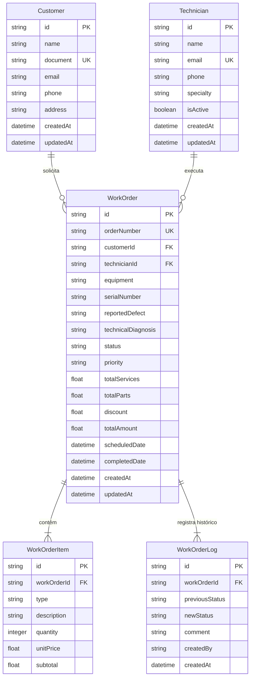

# Research: ELI-9 — Modelagem do Banco de Dados Prisma (Schema, Migrations e Seeds)

**Date**: 2026-09-20T17:01:00-03:00  
**Researcher**: schwenck-e  
**Git Commit**: 147e1b439e6a91b23a41b95ff346ee0d176da475  
**Branch**: eltongomez/eli-8-backend-setup-da-arquitetura-fastify-typescript-prisma  
**Repository**: schwenck-e/ordem-servico-app  

## Research Question
Documentar e mapear a arquitetura atual do banco de dados, os schemas existentes, os requisitos de modelagem relacional, as restrições do conector SQLite no Prisma ORM e a especificação de migrações e seeds vinculadas ao ticket **ELI-9** (`[Backend] Modelagem do Banco de Dados Prisma (Schema, Migrations e Seeds)`).

---

## Summary

O ticket **ELI-9** constitui a segunda tarefa técnica de backend do épico **ELI-7** (`[ÉPICO] Sistema de Gestão de Ordens de Serviço (ordem-servico-app)`), classificado com prioridade **Urgente (P1)**. Seu objetivo é estruturar o schema relacional completo do Prisma para as entidades centrais do sistema (`Customer`, `Technician`, `WorkOrder`, `WorkOrderItem`, `WorkOrderLog`), aplicar a migração inicial consolidada no SQLite local e implementar um script de seed executável para popular registros realistas de homologação e desenvolvimento.

No estado atual do repositório no commit `147e1b439e6a91b23a41b95ff346ee0d176da475`:
- A fundação do backend foi estabelecida pelo ticket **ELI-8**, disponibilizando o framework Fastify 4, TypeScript estrito, plugin do Prisma conectado ao SQLite (`server/src/plugins/prisma.ts`), endpoint `GET /health` e documentação Swagger/OpenAPI.
- O schema Prisma (`server/prisma/schema.prisma`) possui unicamente a entidade de verificação `AppHealth`, com uma migração aplicada (`server/prisma/migrations/20260920035400_init_health`).
- Não existem ainda as tabelas de negócio, índices, relacionamentos de chave estrangeira nem scripts de seed populados.
- As especificações de domínio, regras de relacionamento e restrições do banco estão formalizadas em `thoughts/shared/research/2026-09-15-ordem-servico-backlog.md`.

---

## Detailed Findings

### 1. Metadados e Definição da Tarefa no Linear (ELI-9)
- **Identificador:** `ELI-9`
- **Título:** `[Backend] Modelagem do Banco de Dados Prisma (Schema, Migrations e Seeds)`
- **Projeto Linear:** `Sistema de Gestão de Ordens de Serviço (ordem-servico-app)`
- **Épico Pai:** `ELI-7` — `[ÉPICO] Sistema de Gestão de Ordens de Serviço (ordem-servico-app)`
- **Camada:** `backend`
- **Prioridade:** 1 (Urgente)
- **Status:** Todo / Backlog
- **Critérios de Aceitação / Definition of Done (DoD):**
  - [ ] `prisma/schema.prisma` contendo status (`OPEN`, `IN_PROGRESS`, `WAITING_PARTS`, `WAITING_APPROVAL`, `COMPLETED`, `CANCELED`) e prioridades (`LOW`, `MEDIUM`, `HIGH`, `URGENT`).
  - [ ] Relacionamentos 1:N configurados com chaves estrangeiras e integridade referencial.
  - [ ] Migração aplicada com sucesso no SQLite local (`prisma migrate dev`).
  - [ ] Script de seed populando ao menos 3 clientes, 2 técnicos e 3 ordens de serviço realistas.
  - [ ] Prisma Client gerado e instanciado como singleton tipado.

---

### 2. Estado Físico Atual do Banco de Dados e Prisma no Repositório

#### 2.1 Configuração do Schema Prisma Atual
Em [server/prisma/schema.prisma](https://github.com/schwenck-e/ordem-servico-app/blob/147e1b439e6a91b23a41b95ff346ee0d176da475/server/prisma/schema.prisma#L1-L16):
- **Provider:** `sqlite`
- **URL da Fonte de Dados:** `env("DATABASE_URL")` (configurado como `file:./dev.db` no `.env`)
- **Generator:** `prisma-client-js`
- **Modelos declarados:** Apenas `AppHealth`, utilizado na verificação de integridade no endpoint `GET /health`.

#### 2.2 Migrações Aplicadas
- Diretório `server/prisma/migrations/`:
  - Contém `20260920035400_init_health/migration.sql`, que executa a criação da tabela `AppHealth`:
    ```sql
    CREATE TABLE "AppHealth" (
        "id" TEXT NOT NULL PRIMARY KEY,
        "checkedAt" DATETIME NOT NULL DEFAULT CURRENT_TIMESTAMP,
        "status" TEXT NOT NULL DEFAULT 'UP'
    );
    ```
  - Contém `migration_lock.toml` definindo `provider = "sqlite"`.

#### 2.3 Integração Fastify e Singleton do Prisma
- Em [server/src/plugins/prisma.ts](https://github.com/schwenck-e/ordem-servico-app/blob/147e1b439e6a91b23a41b95ff346ee0d176da475/server/src/plugins/prisma.ts#L1-L28):
  - O cliente `PrismaClient` é instanciado e anexado à instância do Fastify via `server.decorate('prisma', prisma)`.
  - A tipagem é estendida globalmente via `declare module 'fastify' { interface FastifyInstance { prisma: PrismaClient; } }`.
  - O ciclo de vida do pool de conexão é gerenciado pelo hook `server.addHook('onClose', ...)`.

#### 2.4 Scripts Existentes em `server/package.json`
Em [server/package.json](https://github.com/schwenck-e/ordem-servico-app/blob/147e1b439e6a91b23a41b95ff346ee0d176da475/server/package.json#L6-L14):
- `"prisma:generate": "prisma generate"`
- `"prisma:migrate": "prisma migrate dev"`
- `"prisma:studio": "prisma studio"`
- Atualmente não há script `"seed"` nem entrada `"prisma": { "seed": ... }`.

---

### 3. Especificação do Modelo Relacional de Dados

Conforme especificado em `thoughts/shared/research/2026-09-15-ordem-servico-backlog.md`, o domínio da aplicação é composto por 5 entidades centrais com relacionamentos 1:N:



#### 3.1 Detalhamento dos Campos e Restrições de Cada Entidade

##### A. `Customer` (Clientes)
- `id`: `String` `@id @default(uuid())`
- `name`: `String`
- `document`: `String @unique` (CPF ou CNPJ único)
- `email`: `String`
- `phone`: `String`
- `address`: `String`
- `createdAt`: `DateTime @default(now())`
- `updatedAt`: `DateTime @updatedAt`
- **Relação**: `workOrders WorkOrder[]`

##### B. `Technician` (Técnicos)
- `id`: `String` `@id @default(uuid())`
- `name`: `String`
- `email`: `String @unique`
- `phone`: `String`
- `specialty`: `String` (ex: "Hardware", "Eletrônica", "Redes", "Geral")
- `isActive`: `Boolean @default(true)`
- `createdAt`: `DateTime @default(now())`
- `updatedAt`: `DateTime @updatedAt`
- **Relação**: `workOrders WorkOrder[]`

##### C. `WorkOrder` (Ordens de Serviço)
- `id`: `String` `@id @default(uuid())`
- `orderNumber`: `String @unique` (Identificador legível único, ex: `OS-2026-0001`)
- `customerId`: `String` (Chave estrangeira referenciando `Customer.id`)
- `technicianId`: `String?` (Chave estrangeira opcional referenciando `Technician.id`)
- `equipment`: `String` (Descrição do equipamento, ex: "Notebook Dell Vostro 3500")
- `serialNumber`: `String?` (Número de série opcional)
- `reportedDefect`: `String` (Defeito relatado pelo solicitante)
- `technicalDiagnosis`: `String?` (Laudo técnico preenchido durante o atendimento)
- `status`: `String @default("OPEN")` (Valores aceitos pelo domínio: `OPEN`, `IN_PROGRESS`, `WAITING_PARTS`, `WAITING_APPROVAL`, `COMPLETED`, `CANCELED`)
- `priority`: `String @default("MEDIUM")` (Valores aceitos pelo domínio: `LOW`, `MEDIUM`, `HIGH`, `URGENT`)
- `totalServices`: `Float @default(0.0)`
- `totalParts`: `Float @default(0.0)`
- `discount`: `Float @default(0.0)`
- `totalAmount`: `Float @default(0.0)`
- `scheduledDate`: `DateTime?`
- `completedDate`: `DateTime?`
- `createdAt`: `DateTime @default(now())`
- `updatedAt`: `DateTime @updatedAt`
- **Relações**:
  - `customer Customer @relation(fields: [customerId], references: [id], onDelete: Restrict)`
  - `technician Technician? @relation(fields: [technicianId], references: [id], onDelete: SetNull)`
  - `items WorkOrderItem[]`
  - `logs WorkOrderLog[]`

##### D. `WorkOrderItem` (Itens de Serviço e Peças)
- `id`: `String` `@id @default(uuid())`
- `workOrderId`: `String` (Chave estrangeira referenciando `WorkOrder.id`)
- `type`: `String` (Tipo do item: `"SERVICE"` ou `"PART"`)
- `description`: `String`
- `quantity`: `Int @default(1)`
- `unitPrice`: `Float @default(0.0)`
- `subtotal`: `Float @default(0.0)`
- **Relação**:
  - `workOrder WorkOrder @relation(fields: [workOrderId], references: [id], onDelete: Cascade)`

##### E. `WorkOrderLog` (Histórico de Transições e Auditoria)
- `id`: `String` `@id @default(uuid())`
- `workOrderId`: `String` (Chave estrangeira referenciando `WorkOrder.id`)
- `previousStatus`: `String?`
- `newStatus`: `String`
- `comment`: `String?`
- `createdBy`: `String @default("SYSTEM")`
- `createdAt`: `DateTime @default(now())`
- **Relação**:
  - `workOrder WorkOrder @relation(fields: [workOrderId], references: [id], onDelete: Cascade)`

---

### 4. Particularidades Arquiteturais do Conector SQLite no Prisma

1. **Incompatibilidade de `enum` nativo**:
   - No Prisma, blocos `enum Name { ... }` não são suportados pelo conector `sqlite` (`Enums are not supported for the SQLite connector`).
   - Por este motivo, as colunas de status, prioridade e tipo de item são representadas no schema como `String` com valores padrão literais, e a garantia de enumeração estrita é executada na camada TypeScript/Zod da aplicação.
2. **Incompatibilidade do tipo `Decimal`**:
   - O conector SQLite do Prisma não possui suporte nativo ao tipo arbitrário `Decimal` (`Error: You are using the type Decimal which is not supported by the sqlite connector`).
   - Os valores monetários e financeiros (`totalServices`, `totalParts`, `discount`, `totalAmount`, `unitPrice`, `subtotal`) são mapeados para `Float`.
3. **Comportamento de Integridade Referencial (`onDelete`)**:
   - `Customer -> WorkOrder`: `onDelete: Restrict` evita exclusões acidentais de clientes com ordens de serviço ativas ou históricas.
   - `Technician -> WorkOrder`: `onDelete: SetNull` permite que a remoção de um técnico desvincule a atribuição sem apagar a OS.
   - `WorkOrder -> WorkOrderItem` e `WorkOrder -> WorkOrderLog`: `onDelete: Cascade` garante a limpeza consistente dos registros filhos quando a OS for excluída.

---

### 5. Requisitos de Seed para Desenvolvimento e Testes

Conforme o DoD da tarefa, o seed deve ser configurado via TypeScript (`prisma/seed.ts`) e populado pelo comando `prisma db seed`:
- **Clientes (mínimo 3 registros realistas):**
  - Ex: Empresa de advocacia, clínica médica e consumidor final com documentos (CPF/CNPJ), telefones e endereços válidos.
- **Técnicos (mínimo 2 técnicos ativos com especialidades distintas):**
  - Ex: Especialista em eletrônica/solda BGA e técnico de redes/software.
- **Ordens de Serviço (mínimo 3 ordens em diferentes estágios):**
  1. `OS-2026-0001`: Aberta (`OPEN`), prioridade `HIGH`, com itens de serviço e log inicial.
  2. `OS-2026-0002`: Em andamento (`IN_PROGRESS`), prioridade `URGENT`, atribuída ao técnico, com peças e serviços alocados.
  3. `OS-2026-0003`: Concluída (`COMPLETED`), prioridade `MEDIUM`, com diagnóstico técnico, data de conclusão e histórico de transições completo.

---

## Code References

- `server/prisma/schema.prisma:1-16` — Configuração atual do datasource SQLite e modelo inicial `AppHealth`.
- `server/prisma/migrations/20260920035400_init_health/migration.sql:1-7` — Primeira migração SQL gerada no banco.
- `server/src/plugins/prisma.ts:1-28` — Instanciação singleton e injeção do PrismaClient no ciclo de vida do Fastify.
- `server/src/modules/health/health.routes.ts:35-37` — Chamada `$queryRaw` utilizada para validar o banco de dados.
- `server/package.json:10-12` — Scripts atuais de interação com a CLI do Prisma.

---

## Architecture Documentation

### Posicionamento no Fluxo do Backlog
- **Predecessor:** `ELI-8` ([Backend] Setup da Arquitetura Fastify, TypeScript, Prisma SQLite e Swagger) — **Concluído**.
- **Tarefa Atual:** `ELI-9` ([Backend] Modelagem do Banco de Dados Prisma (Schema, Migrations e Seeds)) — **Pronta para execução**.
- **Sucessores Imediatos:**
  - `ELI-10`: [Frontend] Setup do React Vite + Tailwind CSS + Roteamento e API Client.
  - `ELI-11`: [Backend] API CRUD de Clientes com Validação Zod (depende diretamente dos modelos gerados no Prisma Client por ELI-9).
  - `ELI-12`: [Backend] API CRUD de Técnicos com Validação Zod.
  - `ELI-14`: [Backend] API Core de Ordens de Serviço (Criação, Itens e Cálculo de Totais).

---

## Historical Context (from thoughts/)

- `thoughts/shared/research/2026-09-15-ordem-servico-backlog.md:117-208` — Diagrama ERD, diagrama de máquina de estados e dicionário de dados do produto.
- `thoughts/shared/research/2026-09-15-ordem-servico-backlog.md:253-261` — Escopo e Definition of Done (DoD) formal da tarefa ELI-9.
- `thoughts/shared/research/2026-09-19-ELI-8-backend-architecture-setup.md:1-141` — Pesquisa de arquitetura do backend e validação da stack Fastify + Prisma SQLite.
- `thoughts/shared/plans/2026-09-19-ELI-8-backend-architecture-setup.md:1-685` — Plano de implementação de infraestrutura concluído na branch atual.

---

## Related Research

- [2026-09-15-ordem-servico-backlog.md](file:///Users/egsl/Documents/ordem-servico-app/thoughts/shared/research/2026-09-15-ordem-servico-backlog.md)
- [2026-09-19-ELI-8-backend-architecture-setup.md](file:///Users/egsl/Documents/ordem-servico-app/thoughts/shared/research/2026-09-19-ELI-8-backend-architecture-setup.md)

---

## Open Questions

- *Nenhuma pendência arquitetural identificada*: As restrições de compatibilidade do provider SQLite (uso de `Float` para valores numéricos e `String` para enums validados na aplicação) estão mapeadas e em conformidade com o ecossistema Fastify + Zod estabelecido no projeto.
